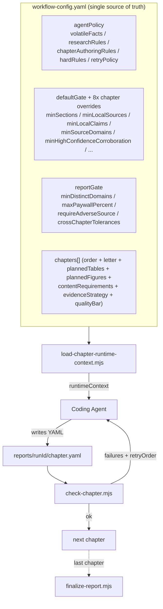
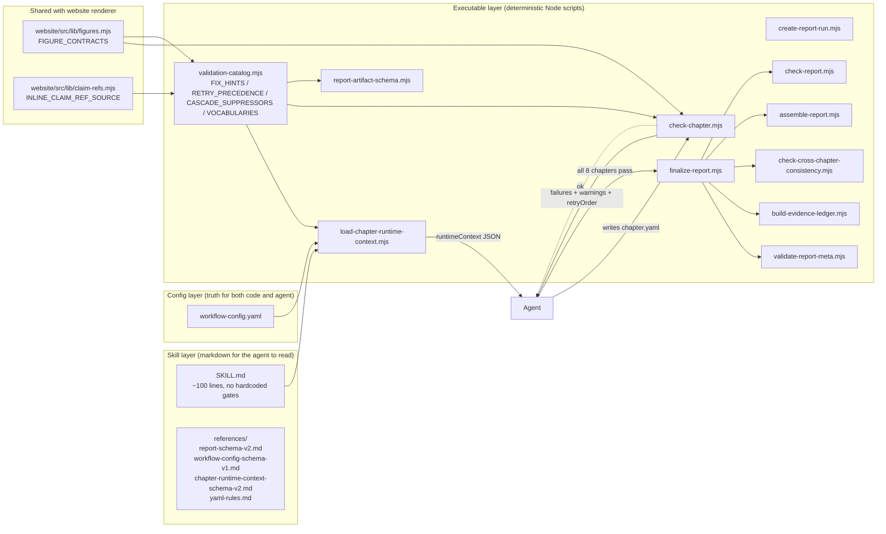
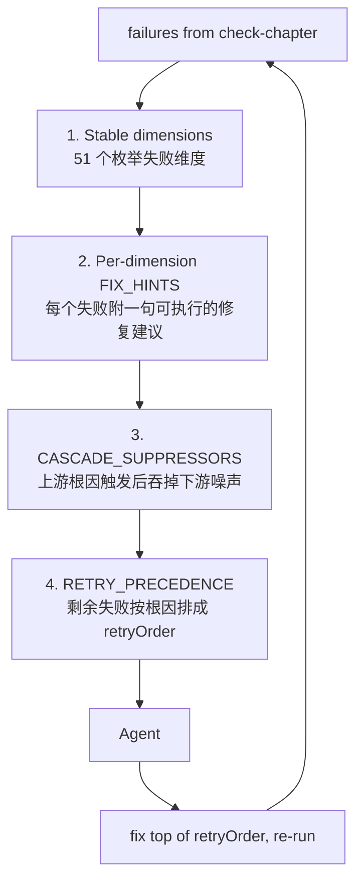
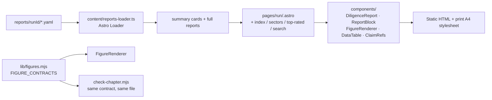

# 用 Coding Agent + Schema 编排，造一个会自我校验的 Startup Research 站点

> 这篇文章拆解 [`startup.genisisiq.com`](https://startup.genisisiq.com) 背后的设计：一个让 coding agent 端到端生成、校验、装配并渲染创业公司 diligence 报告的流水线。当前仓库已经产出 **46 份完整报告**、**9,424 条 source**、**14,397 条 atomic claim**，全部由 agent 自动跑出，没有任何人工誊抄。

---

## 1. 这个网站是什么

`startup.genisisiq.com` 是一个**结构化的早期/成长期公司尽调报告库**。每份报告覆盖一家公司的：

- Company Overview
- Market Analysis
- Competitors
- Financials
- Product & Technology
- Customers
- Risks
- Valuation

每份报告都不是一篇散文，而是一份强 schema 的 YAML 数据集（claims、sources、figures、tables、callouts、evidenceGaps），由网站统一渲染成阅读体验一致的版面。读者点开一份 OpenAI 报告看到的"recommendation: research-more"和"riskRating: medium-high"，背后是一颗一颗 **claim → source → URL → quote** 的完整证据链，并且每条 claim 在页面里都能溯源到 inline `[CO012]` 引用，开关一按全文显示/隐藏。

> 关键差异：内容生成由 agent 完成，但**网站本身不调 LLM**。所有 LLM 输出都在生成阶段被结构化、校验、定型，最终留下的是确定性的 YAML。网站只做静态渲染。

---

## 2. 我怎么用 Coding Agent 完成全部内容

直接说结论：**我不让 agent "写一篇报告"，我让 agent "运行一个流水线"**。

具体来说，agent 的所有动作都被一个叫 `startup-research` 的 skill 锁定在固定路径上：

```
用户输入 (companyName, companyUrl?, refresh?, ...)
        │
        ▼
┌─────────────────────────────────────┐
│ skill: startup-research             │
│  step 1  load runtime context       │ ← 读 workflow-config.yaml + vocab + 渲染 contract
│  step 2  create-report-run          │ ← 生成 reports/<runId>/ 占位
│  step 3  for chapter 1..8:          │
│           - load chapter context    │
│           - search + fetch-url      │ ← 调用另一个 skill
│           - 写 chapter YAML         │
│           - check-chapter (gate)    │ ← 失败就把 retryOrder 反给 agent
│           - 修 / 重写 / 通过        │
│  step 4  finalize-report            │ ← validate-meta → ledger → cross-check → assemble
└─────────────────────────────────────┘
        │
        ▼
reports/<runId>/{01..08}-*.yaml + evidence.yaml + full-report.yaml + summary-card.yaml
        │
        ▼
website (Astro static build) → 部署
```

Agent 在每一步看到的不是模糊的 prompt，而是**具体的命令、具体的 schema、具体的失败维度和具体的修复建议**。SKILL.md 不超过 100 行，因为它的唯一职责是告诉 agent："去读 runtimeContext，去跑这些命令"。所有真正会变的策略都在 `workflow-config.yaml` 和 `validation-catalog.mjs` 里，agent 每次循环都重新读。

---

## 3. 怎么把任务编排成 Workflow

整个 workflow 的灵魂是一个文件：[`.agents/skills/startup-research/references/workflow-config.yaml`](.agents/skills/startup-research/references/workflow-config.yaml)（≈600 行）。它既是 agent 的"宪法"，也是脚本的"配置"，更是 schema 校验的"门禁规则"。



### 几个关键设计点

**(a) 每个 chapter 都有自己的 letter 命名空间。**`company-overview` 用 `O`，所以那一章产生的 ID 是 `SO001`、`CO045`、`TO003`、`FO002`、`QO007`。`market-analysis` 用 `M`，依此类推。这让 8 个章节可以**完全并行起草**，不会撞 ID。最后 `finalize-report` 按 canonical URL 在 evidence ledger 层去重。

**(b) 每个 chapter 有自己的 gate。**`defaultGate` 给出基础门槛（≥25 sources、≥35 claims、≥10 distinct domains、至少 1 条 adverse source 等），各章节可以在 `chapter.gate` 里按需加严，比如 `valuation` 必须包含 stance: adverse 的源，`financials` 默认得有 `filing` 类型源等。

**(c) 整份报告还有 reportGate。**8 章全过之后，再做一次 cross-chapter 一致性检查：metric 漂移≤10%、关键事实 70% token 重叠时必须指回 company-overview，全报告至少 30 个独立 domain，paywall 类源不超过 30%。这一层捕捉的是"每章自己看都没问题、合在一起前后矛盾"的隐性 bug。

**(d) Agent 通过运行时 context 拿到所有"会变的事实"。**`load-chapter-runtime-context.mjs` 读 `workflow-config.yaml`，吐出一个 JSON 给 agent，里面包含：

- `runtimeContext.chapter` — 当前章的 brief、planned tables/figures、content requirements、quality bar、绑定的 gate
- `runtimeContext.workflow.agentPolicy` — researchRules / chapterAuthoringRules / hardRules / volatileFacts / retryPolicy
- `runtimeContext.vocabularies` — 全部受控字典（sourceType、stance、claimType、figureType...）
- `runtimeContext.checkDimensions` + `defaultFix` — 51 个失败维度 + 每个维度的一句话修复建议
- `runtimeContext.rendererContracts` — 每种 figure 类型必须填哪些 data 字段（来自网站的 [`figures.mjs`](website/src/lib/figures.mjs)）
- `runtimeContext.runCache.disclosureHint` / `refresh-context` — 涉及私有公司或 refresh 模式时的额外背景

这就是为什么 SKILL.md 里几乎没有"硬编码"的策略——所有策略都从一个文件流到 agent 手里，单一来源。

---

## 4. 技术细节

### 4.1 为什么我要重写 `fetch-url`，而不是用 GitHub Copilot CLI 自带的 `web_fetch`

默认的 `web_fetch` 类工具足以覆盖"打开一个 blog post 取段落"的场景，但创业公司尽调的 80% 工作不是读 blog——是啃 `*.sec.gov` 上的 S-1、`reuters.com` 上要 cookie wall 的新闻、被 DataDome / Cloudflare 挡的 `wsj.com` 文章、500 页的 PDF 招股书、需要 `Sec-Fetch-Site` header 才肯返回完整 HTML 的产品页。这些场景里默认 fetch 工具的失败模式是**"看起来成功，其实只拿到了 cookie 同意墙的 HTML"**——agent 接着把那段 HTML 当成 source，error 被静默吞掉。

所以 [`fetch-url`](.agents/skills/fetch-url/) 这个 skill 的本质是 **"一条命令，最大化让 agent 拿到可读正文"**。它在 `node .agents/skills/fetch-url/scripts/fetch.mjs <url>` 这一条简单接口背后做了：

1. **Identity profile + curl-impersonate**。内置 `desktop-chrome` / `desktop-firefox` / `desktop-safari` / `mobile-safari` / `googlebot` / `bingbot` 6 套指纹（TLS JA3 + HTTP/2 settings + header 集合），优先用 `bingbot` 拉。被 challenge 时自动按 `PROFILE_ORDER` 轮换浏览器指纹再试。

2. **Per-host strategy fast-path**。仓库里塞了 [`host-strategies.json`](.agents/skills/fetch-url/references/host-strategies.json)，**674 个域**已经预探测过，记录每个域的"获胜组合"（例如 `reuters.com` → `desktop-firefox`，`wsj.com` → `wayback`）。命中 fast-path 直接走最优策略，省掉整条 fallback 链。三层查找（精确 host → www. 别名 → registrable domain）保证 `data.sec.gov` 也能命中 `sec.gov` 的策略条目。

3. **Reader / Wayback 自动降级**。Origin 全套指纹失败后自动走 `r.jina.ai` 的 reader 接口；再失败走 `web.archive.org`。命令行 `--no-reader` / `--no-wayback` 可以强制单源测试。

4. **PDF 路径完整。**响应体前 1KB 检测 `%PDF-` 魔术字节，命中后管道送 `pdftotext`，返回纯文本。10-K、S-1、招股书、court filings 都能一行命令拿正文。Scanned PDF 不做 OCR，agent 会被告知文本为空。

5. **可读正文抽取。**默认对 HTML 启动 boilerplate 剥离：`BLOCK_TAGS` 白名单 + `NOISE_HINT_RE`（cookie/consent/newsletter/popup/modal/share-buttons/related-articles 等噪声关键字），保留主内容；`--full-text` 关掉清理用于产品 / pricing / docs 页。

6. **磁盘缓存 + TTL**。默认 7 天 TTL，按 URL hash 落盘 `.fetch-cache/`。在 chapter loop 里同一份 URL 被多个 chapter 引用时不重复打源站。`--refresh-cache` / `--no-cache` 是逃生口。

7. **structured `--json` 输出**。返回 `status / finalUrl / source / cache / contentType / bytes / elapsedMs / title / extractionMode / truncated / output`。agent 拿到结构化字段后能 record 到 `localEvidence.sources[]`，而不是把渲染好的 markdown 再 parse 一次。

设计取舍：**给 agent 一条命令 + 一堆"逃生口"，而不是给 agent 一堆并列功能**。SKILL.md 第一行就是 "Start here: `node .agents/skills/fetch-url/scripts/fetch.mjs <url>`"。后面列的全是 "use only when..."。这是有意的——agent 的注意力是 token，多一个等价路径就多一次错误选择。

### 4.2 startup-research：harness engineering 的实战

这是整个项目的核心，体现的是一种 **harness engineering** 的思路：把 LLM 当作一个**强但易漂移的执行器**，在它周围用确定性代码搭一个"井"，让它的错误模式被立即捕捉并以可执行的方式反馈回来。

#### 4.2.1 总体架构



#### 4.2.2 用 schema 的好处

`report-schema-v2.md` + `validation-catalog.mjs` + `figures.mjs` 三个文件加起来定义了：

- 每个 artifact 顶层结构（`schemaVersion / artifact / slug / runDate / company` 等）
- 每个对象的 ID 命名规则（`<Type><ChapterLetter><Seq3>`，例 `SO001`）
- 23+ 个受控字典（sourceType、claimType、recommendation、figureType、calloutType...）
- 14 种 figure type 的 data 形状契约（`timeline` 必须有 `items[]`，`dag` 必须有 `nodes[]` + `edges[]`，`bar` 必须 `items[]` + `series[]`...）
- inline claim ref 的正则（`[CO045]` 或 `[CO045, CO046]`），由网站和校验器**共享同一个**正则源

带来的直接好处：

1. **Agent 不能瞎写。**写出 `confidence: very-high` 立刻被 `check-chapter` 拒绝，并附 fix `Use a value from the allowed enum`。
2. **网站不需要"宽容渲染"。**渲染层可以假设"这里一定是合法的 figure type、合法的 layout、合法的 claim ref"，不用写一堆 fallback。Bug 发生时是 schema 校验阶段挂掉，不是页面静默渲染错。
3. **报告之间高度可比。**46 份报告完全同形，可以做跨公司聚合（top-rated、按 sector/stage 索引、RSS feed）。
4. **回归保护。**[`check-reports-contract.mjs`](.agents/skills/startup-research/scripts/check-reports-contract.mjs) 在 CI 里把所有历史报告重跑一次结构 + 渲染契约校验，schema 改动不能悄悄打破老报告。

#### 4.2.3 分层与职责切分

| 层 | 谁读 | 谁写 | 职责 |
|---|---|---|---|
| `SKILL.md` | Agent | 人 | "去做什么"，不放策略 |
| `references/*.md` | Agent | 人 | schema 形状 + YAML 规则文档 |
| `workflow-config.yaml` | 脚本 + agent (经 loader) | 人 | 章节配置、agent policy、所有 gates |
| `validation-catalog.mjs` | 所有 check 脚本 + loader | 人 | 字典、维度、修复提示、cascade、precedence |
| `report-artifact-schema.mjs` | check-chapter + check-report | 人 | 单对象 schema 校验 (table / figure / claim / source) |
| `figures.mjs` | check-chapter + 网站 | 人 | figure type → data 字段契约 |
| `load-chapter-runtime-context.mjs` | agent (作为 CLI) | 人 | 把上面这些**投影**成 agent 可消费的 runtime context JSON |
| `check-chapter.mjs` | agent (作为 CLI) | 人 | 单章节"门禁"，输出 failures/warnings/retryOrder |
| `finalize-report.mjs` | agent (作为 CLI) | 人 | 串起 validate-meta → ledger → x-chapter → assemble → report-check |

**核心原则：**
- **Single source of truth.**每条字典、每个常量、每条修复建议都只在一个文件里定义。`validation-catalog.mjs` 是中央仓库，`figures.mjs` 是渲染契约，两者都被 check 脚本和 loader 一起读。
- **Code = config + projection.**Agent 看到的"运行时 context"只是 config 的投影，不是另一份配置。当我修 `workflow-config.yaml` 加一条 chapterAuthoringRule，agent 的下一次循环就自动看到。
- **Markdown 不放策略。**SKILL.md 和 schema 文档不重复 enum 和门槛。agent 被明确告知"去读 runtimeContext"。这是为了避免"文档说 ≥25 sources、config 写 ≥30、agent 凭印象写 ≥20"的三方漂移。

#### 4.2.4 Harness engineering：把 agent 放在井里

这是最关键的部分。我把它分成 4 个杠杆。



**杠杆 1：稳定的失败维度（51 个）。**`check-chapter` 不返回字符串，返回结构化 entries：

```json
{
  "dimension": "highConfidenceCorroboration",
  "file": "04-financials.yaml",
  "message": "claim CI012 has confidence:high but only 1 sourceRef and none are primary tier",
  "fix": "On claim CI012: either downgrade confidence:high to medium, or add 1 more sourceRef(s) including a primary-tier one (filing|regulatory|legal|official or reputationTier:high).",
  "claimId": "CI012",
  "actual": 1,
  "required": 2
}
```

`dimension` 是稳定的字符串枚举。Agent 可以 `switch` 它，不用 NLP 解析消息。

**杠杆 2：FIX_HINTS = 可执行的一句话。**每个维度都注册一句话修复建议（[`validation-catalog.mjs`](.agents/skills/startup-research/scripts/validation-catalog.mjs) 里 51 条），其中很多是函数形式，会用 `extra` 上下文回填具体值（"add **2** more sources" 而不是 "add more sources"）。SKILL.md 不再需要重复一份"修复表"。

**杠杆 3：Cascade suppression。**当上游根因触发（`yamlParse` / `localEvidenceMissing`），所有下游必然失败的维度（sources / claims / enumeration / tableShape / figureShape / 各种 ref 校验）从 `failures[]` 里被剔掉，但出现在 `suppressedDimensions[]` 里告诉 agent："这些维度被吞掉了，等你修完上游它们会自动重测"。这一层避免了 agent 看到 50 条全是同一个根因的派生错误。

**杠杆 4：Retry precedence。**剩下的 `failedDimensions[]` 按根因排成 `retryOrder[]`：先 schema → 再 source / claim shape → 再 corroboration / claim refs → 再 enumeration → 再 tableShape / figureShape → 再 depth 量级。Agent 顺着 retryOrder 修，不会修了下游又被上游覆盖。

**额外加分项：**

- **Object-level aggregation.**同一个 `T102` 上 2 条问题被合并成一个 bucket（`objectFailures[]`），agent 看到的是"table T102 has 2 problems"而不是两条孤立条目。
- **Global hints.**同一维度在 ≥3 个 object 上失败时，单独冒一条 chapter-wide 提示，让 agent 一次性修整章而不是逐个 patch。
- **Acknowledged warnings.**Warning 级（例 `tableNotes`、`paywallRisk`）允许 agent 通过 `acknowledgedWarnings: [{dimension, reason}]`（≥30 字理由）显式跳过，而不是被迫造内容。
- **Multi-format output.**`--format json` / `--format compact` / 默认 `text`。compact 让 shell loop 用 `head -1` 拿 status、`grep ^FAIL` 拿失败，省掉 jq。

> 一条原则：**所有 check 脚本"一次性返回所有问题"**。除了 `check-workflow-config` 历史上是 fail-fast（已经被改成累计）外，全部 check 脚本都把违规推到 `failures[]` / `warnings[]` 跑完再退出。Agent 不应该在每次只看到一条错误的状态下决策。

#### 4.2.5 Agent 看不到的地方：retry policy

`workflow-config.yaml` 里写了 `retryPolicy.maxChapterRetries: 3` 和 `requireMonotonicFailureDecrease: true`。这是一个简单但有效的 fail-safe：每次重试失败维度数必须严格下降，否则视为收敛失败。这避免了 agent 在 retry 里"修一个又破坏一个"的鸡飞狗跳。

---

## 5. 网站层（Astro 静态站）

网站只做一件事：**把 YAML 渲染成可读、可打印、可索引的页面**。



几个有意思的细节：

- **Renderer contracts 是 schema 的同一份文件。**`website/src/lib/figures.mjs` 既是网站渲染分支判断的依据，也被 skill 的 `check-chapter` 直接 `import`。新增一种 figure 类型只改一个地方，agent 立刻知道契约，渲染层立刻支持。
- **Inline claim refs。**任何 claim 都能在 prose 里以 `[CO045]` 出现，渲染层把它替换成 `<a class="claim-ref" href="#claim-CO045">`。开关一按 `.refs-visible` 全文显示/隐藏，**而 inline ref 的正则源（`INLINE_CLAIM_REF_SOURCE`）**被网站和校验器共享，永远不会双向漂移。
- **A4 print pipeline。**直接用浏览器原生 `window.print` + CSS Paged Media。@page 设了 18mm 边距，`@bottom-left` 印 "Yingting Huang · startup.genisisiq.com"，`@bottom-center` 印页码。表格 `thead` 跨页重复、`tr break-inside: avoid` 防截断、figure / callout / metric tile 全部 `break-inside: avoid`。打 PDF 不需要 puppeteer 也不需要 server。
- **Astro Loader 决定一切。**[`reports-loader.ts`](website/src/content/reports-loader.ts) 直接读 `../reports/*/`，把 YAML 喂进 Astro 的 content collections。报告增删只是文件系统层面的事，重新 build 即生效。
- **静态部署。**没有数据库、没有 SSR、没有运行时 LLM 调用。整个站的语义由 YAML 决定，由 Astro build 凝固，CDN 一推即可。

---

## 6. 还有哪些值得说

这些点你前面没列，但写文章时值得带：

### 6.1 Refresh / revision graph

每份报告都有 `revision: { status, refreshOfRunId, supersededByRunId, refreshReason }`。当用 `--refresh` 模式重跑时：

- `create-report-run` 不覆盖旧 run，而是开新 `<runId>` 文件夹。
- 新报告的 `revision.refreshOfRunId` 指向旧；旧报告的 `revision.supersededByRunId` 指向新。
- [`check-revision-graph.mjs`](.agents/skills/startup-research/scripts/check-revision-graph.mjs) 验证两侧指针对称、不指自己、不存在悬空引用。
- 网站顶端 banner 自动渲染 "Refreshed report" 或 "Superseded — view the current report"。

这让 diligence 这种"会过期"的内容有了可审计的版本历史。

### 6.2 Disclosure profile

私有公司 / stealth 公司财务数据天然缺失。如果在创建 run 时传 `--disclosure private-undisclosed`，会写出 `disclosure-hint.yaml`，里面预先列了 chapter 04 必须采用的 canonical evidence gaps（"无审计财报"/"无 ARR 披露"/...），agent 不再花时间重复"发现"这些 gap，而是直接采用结构化标记。

### 6.3 Adverse-evidence distribution

`reportGate.adverseDistribution` 不只要求"全报告至少 1 条 adverse 源"，还要求 `company-overview` / `financials` / `customers` / `valuation` 这 4 章**每章都要有至少 1 条 stance: adverse 源**。这一层强制 agent 不能把所有"敌意证据"集中堆到 risks 章应付检查。loader 把它注入到这些章的 `gate.minAdverseSources`，让单章 check 就能拦下来。

### 6.4 历史报告的回归保护

[`check-reports-contract.mjs`](.agents/skills/startup-research/scripts/check-reports-contract.mjs) 是仓库 CI 里跑得最重的一个。它把所有 46 份历史报告再过一遍渲染契约 + summary-card schema。**目的不是重新打分，而是确保 schema / renderer 改动不会悄悄打破老报告。**`npm run validate` 把它 + `check:workflow-config` + `check:revision-graph` + `astro build` 串起来，30 秒内跑完。

### 6.5 Local fetch trail

可选地通过 `STARTUP_FETCH_LOG_PATH` 让 fetch-url 在每次成功后写一行 trail。`check-chapter` 会把章里出现的 URL 和 trail 做交集，发出**软**警告"这个 URL 你引用了但本地没 fetch 过"。这是为了挡住"agent 直接从训练数据里编 URL"的幻觉模式。

### 6.6 Parallel chapter authoring

8 章可以并行起草（letter 命名空间 + 最终 ledger 去重）。但 `gate.minNetNewSources` 和 `crossChapterRefLeak` 会跨读兄弟章，所以最佳实践是：**8 章 YAML 都 draft 好之后再统一跑 8 次 check-chapter**，预期会有几次 retry 用来消化 URL overlap。`finalize-report` 本身串行。

### 6.7 工具搭得多深，prompt 就能写得多浅

整个 SKILL.md ≈100 行，因为所有"会变的事实"都在 config 和 catalog 里。Prompt 里写"按 schema 写"是空的；prompt 里写"按 runtimeContext.workflow.allowedReportFiles 写"是有齿的。这是**harness engineering 的副产物**：你越投资在外围的可执行 schema 和反馈通道上，prompt 就越短、越稳定、越好审。

---

## 总结

这套设计可以浓缩成三句话：

1. **YAML 为世界模型，不是渲染中间件。**Agent 输出 YAML，YAML 经 schema 验证，网站只负责把 YAML 凝固成静态 HTML。
2. **Workflow 是配置，不是 prompt。**`workflow-config.yaml` 一个文件管所有 gates、policy、章节布局；agent 通过 `runtimeContext` 看到的是它的投影。
3. **校验器是 agent 的反馈通道。**51 个稳定失败维度 + 一句话 fix + cascade suppression + retry precedence，让 agent 从"看一句模糊错误自由发挥"变成"读一个结构化 retryOrder 顺序修"。

最后一个数字：当前仓库 [`.agents/skills/`](.agents/skills/) 一共 **9,503 行**（脚本 + schema + 文档），换来 **46 份完整 diligence 报告 / 9,424 sources / 14,397 claims**，全自动产出，可重复验证。这就是 harness engineering 在 LLM 时代的复利。

— Yingting Huang · `startup.genisisiq.com`
