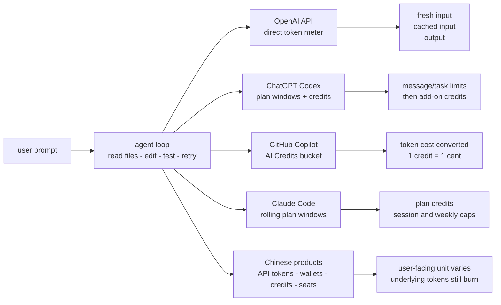
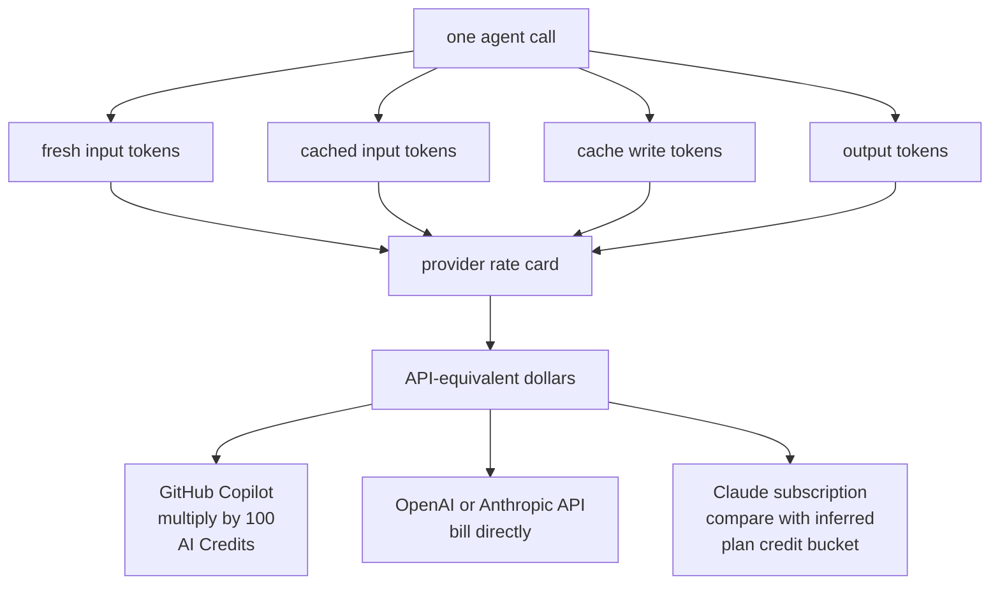
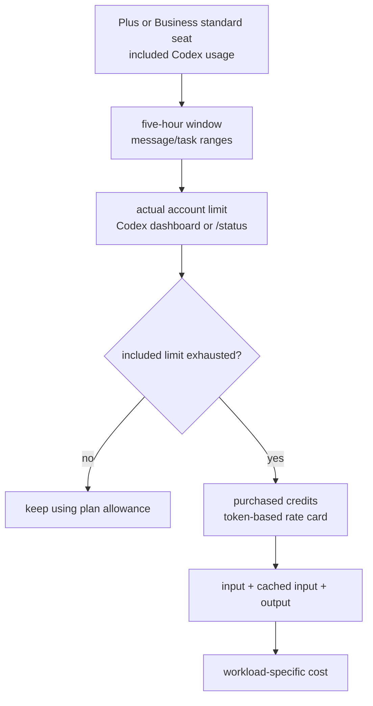
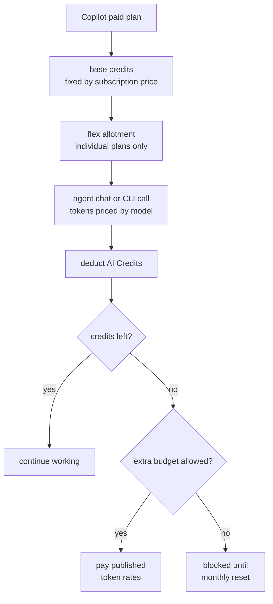
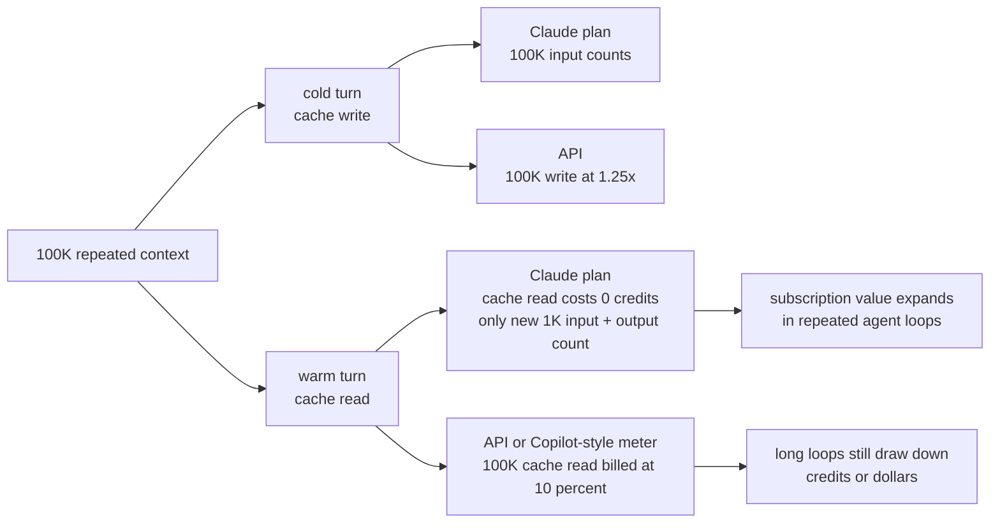
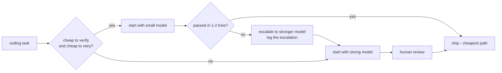

# AI Coding Assistant Pricing in 2026: The End of the Flat-Fee Era

AI coding assistants have crossed an economic boundary. Autocomplete and chat were cheap enough to bundle. Agents that read repositories, edit files, run commands, inspect logs, retry tests, and work for hours from one prompt are not.

A $10 or $20 subscription can still cover lightweight completions. It struggles when a coding agent carries a large repository context through dozens of model calls. In 2026, AI coding pricing is increasingly about tokens, credits, rolling limits, cache hit rates, and model choice.

This is a May 2026 snapshot for developers and engineering leaders. The exact numbers will move, but the useful comparison is stable: convert each plan into practical agent-session capacity, not just a headline monthly price.

## Why flat-fee AI coding broke

The first generation of AI coding subscriptions hid inference cost. That worked for completion and chat. Agentic coding changed the unit of work: one human request can become a loop.

1. Read files.
2. Build a plan.
3. Edit code.
4. Run tests or commands.
5. Parse errors.
6. Re-read context.
7. Try again.

Each pass consumes input, output, tool schemas, system instructions, conversation history, and often repeated repository context. The pricing question is no longer only "which assistant is smartest?" It is "which assistant gives me the right model, cache behavior, and spending controls for this coding workflow?"

## The pricing map: where each platform puts the guardrail

The major coding platforms are all becoming usage-aware, but each places the guardrail in a different place: raw tokens, plan windows, credits, rolling limits, wallets, action caps, or per-seat bundles.

| Platform | Pricing philosophy | Best fit | Main risk |
| :-- | :-- | :-- | :-- |
| **OpenAI API + ChatGPT Codex** | Raw token utility billing, or ChatGPT plan windows with add-on credits | Teams building coding tools, internal dev agents, CI automation, and developers using Codex through ChatGPT plans | API costs scale directly; ChatGPT Codex plan value depends on model mix and hidden account limits |
| **GitHub Copilot** | Subscription plus AI Credits / usage-based metering for premium and agentic work | Developers who want IDE-native workflows, GitHub integration, and enterprise pooling | Budget predictability declines as agent mode and code review usage grows |
| **Claude Code** | CLI subscription windows or direct API billing | Terminal-native developers who want strong agentic workflows and repository manipulation | Rolling limits interrupt work, while API mode can become expensive quickly |
| **Chinese AI coding products** | API token billing, usage wallets, weighted credits, action limits, or cloud ecosystem subscriptions | Cost-sensitive router stacks, domestic cloud users, and teams evaluating lower-cost long-context models | Meter opacity, ecosystem lock-in, registration/payment friction, and compliance uncertainty for international teams |

OpenAI exposes both direct token billing and ChatGPT Codex plan limits. GitHub wraps premium usage in AI Credits. Anthropic uses rolling windows for subscriptions and direct token billing for API mode. Chinese AI coding products broaden the taxonomy: some sell raw APIs, while others hide token burn behind wallets, credits, turn counts, or enterprise seats.



## Chinese AI coding products: billing units beyond tokens

The Chinese AI coding market is a useful second lens because it exposes the same economics through more product shapes. The foundation models still consume tokens, but the user-facing meter is not always a raw token counter. Vendors abstract the cost into wallets, credits, action limits, per-seat subscriptions, or cloud ecosystem bundles.

| Product pattern | Example products | User-facing measurement | Cost-model lesson |
| :-- | :-- | :-- | :-- |
| **API-first token billing** | DeepSeek, Moonshot Kimi | Input tokens, cached input, output tokens, often priced per 1M tokens | Best for router stacks and disciplined prompt caching; cost is transparent but belongs to the developer. |
| **Token wallet subscription** | ByteDance Trae IDE | Monthly plan converts into a usage wallet; requests deduct value based on model and token burn | Predictable sticker price can still create taxi-meter anxiety when an agent loops. |
| **Weighted credits** | Tencent CodeBuddy-style plans | Credits deducted by task complexity and model tier | Similar to GitHub Copilot AI Credits: easier to budget than tokens, but harder to audit precisely. |
| **Action limits** | Tongyi Lingma free tier, Trae free tier | Agent turns, chat turns, or autocomplete counts | Friendly for entry users, but action counts hide context size and model mix. |
| **Flat per-seat enterprise plans** | Tongyi Lingma enterprise, Tencent team plans | Fixed user/month seat price, often with governance or cloud integration | Enterprises buy budget predictability and admin controls, while the vendor manages token risk. |
| **Output/value metrics** | Baidu's proposed Daily Active Agents lens | Active autonomous agents rather than token consumption | A future direction: measure delivered workflow value instead of compute input. |

This confirms the larger pattern: tokens are the substrate, not always the product unit. A developer may see "$20 wallet", "1,000 credits", "50 agent turns", or "$32/user/month", but every agentic workflow still burns context, output, tool calls, and retries underneath.

The extra question to ask is: **who owns variance risk?** API tokens and wallets push variance to the developer. Per-seat plans push more of it to the vendor. Credits sit in the middle: easier to budget than tokens, but opaque unless the platform exposes model-level and session-level usage. For a fair comparison, do not compare "1,000 credits" with "1,000 credits" across vendors. Compare expected cost per completed task after cache hit rate, model mix, retry count, and human cleanup.

It also changes total cost of ownership. Chinese API-first providers such as DeepSeek and Kimi can be extremely attractive for a hybrid stack -- for example, an open-source IDE or router front end calling cheap long-context models directly. But proprietary Chinese IDEs and cloud products can add non-token friction: regional registration, payment rails, enterprise deployment requirements, and less familiar compliance posture for international teams. In practice, the low-cost path is often not "pick one Chinese IDE"; it is "decouple the interface from the model and route work to the cheapest reliable backend."

That makes three practical due-diligence checks important for Chinese AI coding products:

1. **Meter visibility:** Can developers see cost by model, task, session, and agent loop?
2. **Exit path:** Can the IDE bring your own API key or route to another model, or is the low price tied to one ecosystem?
3. **Operational friction:** Does registration, payment, data residency, or compliance make the cheap model expensive to adopt?

## How to translate a plan into tokens

For the detailed OpenAI, Copilot, and Claude comparison below, three accounting models show up repeatedly. Chinese wallets, credits, and action caps can usually be mapped back to the same underlying token economics when enough usage data is exposed.

For API billing, the basic formula is:

```text
cost = (fresh_input_tokens * input_rate
	+ cached_input_tokens * cached_rate
	+ cache_write_tokens * cache_write_rate
	+ output_tokens * output_rate) / 1,000,000
```

Not every provider exposes every category. OpenAI generally uses fresh input, cached input, and output. Anthropic API pricing also separates cache writes from cache reads.<sup>[5](#ref-5)</sup>

For GitHub Copilot, the dollar cost is converted to GitHub AI Credits:

```text
GitHub AI Credits = API-equivalent dollar cost * 100
```

1 GitHub AI Credit equals $0.01 USD.<sup>[4](#ref-4)</sup>

For Claude subscriptions, the public product pages do not expose a direct token allowance. The best analysis I found is ShellaC's reverse-engineering of Claude's usage bars and SSE usage fractions.<sup>[9](#ref-9)</sup> The method matters: ShellaC observed unrounded utilization floats in Claude's server-sent event responses, treated those values as `used / limit`, recovered the likely underlying fractions, took the least common multiple of denominators across samples to infer session and weekly limits, then validated token-to-credit formulas against observed usage changes. That makes the numbers useful, but unofficial.

In that analysis, Claude plan usage is tracked by an internal credit-like unit:

```text
Claude plan credits used = ceil(input_tokens * input_rate + output_tokens * output_rate)
```

The inferred model rates are:

| Claude model class | Input credit rate | Output credit rate | Relative meaning |
| :-- | --: | --: | :-- |
| **Haiku** | 2/15 = 0.133 credits/token | 10/15 = 0.667 credits/token | Cheapest |
| **Sonnet** | 6/15 = 0.400 credits/token | 30/15 = 2.000 credits/token | Middle |
| **Opus** | 10/15 = 0.667 credits/token | 50/15 = 3.333 credits/token | Most expensive |

This mirrors Anthropic API pricing ratios: output is roughly 5x input, and Opus is much more expensive than Haiku. The key difference is caching. Claude API cache reads cost 10% of input price; ShellaC observed that Claude subscription cache reads consume no plan credits, while cache writes count like input tokens.<sup>[9](#ref-9)</sup>

To compare providers, I will use one reference workload for OpenAI and Copilot:

```text
One reference agent model call = 100K cached input + 10K fresh input + 2K output
```

That is one model call inside an agent loop, not a full coding session. A real task may use 10, 25, or 50+ calls depending on file reads, test runs, and retries.



## OpenAI: utility pricing and model routing

OpenAI API billing is direct: choose a model, send tokens, receive tokens, and pay the rate card. Larger reasoning models cost more; smaller models are better for fast, low-risk coding tasks.

The practical implication: there is no single "coding model". A useful stack routes by task.

| Task type | Good routing choice | Why |
| :-- | :-- | :-- |
| Inline completion, small snippets, regex help | Small / fast coding model | Low latency and low cost matter more than deep reasoning |
| Unit test generation or documentation | Mid-tier model | Needs context, but usually not the most expensive reasoning path |
| Multi-file refactor | Agent-oriented coding model | Needs repository awareness and long-horizon task execution |
| Architecture review, hard debugging, concurrency bugs | Frontier reasoning model | Quality can justify the premium when mistakes are expensive |
| Bulk codebase documentation or mechanical migrations | Batch or lower-priority processing | Latency is less important than cost |

OpenAI's useful cost levers for coding agents are prompt caching, batch processing, lower-priority routing, and hosted execution for code verification.<sup>[1](#ref-1)</sup> Direct API use needs prompt discipline: stable prefixes, small context, and explicit routing.

Here is what the math looks like for a $10 API budget using the reference agent model call above:

| OpenAI model | Rates: input / cached / output | What $10 buys if all one token type | Cost per reference call | Calls per $10 |
| :-- | :-- | :-- | --: | --: |
| **GPT-5.5** | $5.00 / $0.50 / $30.00 per 1M tokens | 2.0M input, 20.0M cached input, or 0.33M output | $0.160 | 62 |
| **GPT-5.4** | $2.50 / $0.25 / $15.00 per 1M tokens | 4.0M input, 40.0M cached input, or 0.67M output | $0.080 | 125 |
| **GPT-5.3-Codex** | $1.75 / $0.175 / $14.00 per 1M tokens | 5.71M input, 57.1M cached input, or 0.71M output | $0.063 | 158 |
| **GPT-5.4 mini** | $0.75 / $0.075 / $4.50 per 1M tokens | 13.3M input, 133.3M cached input, or 2.22M output | $0.024 | 416 |

The spread is large. The same $10 buys about 62 GPT-5.5 reference calls or 416 GPT-5.4 mini calls. If a session takes 25 calls, that is roughly $4.00 on GPT-5.5, $1.58 on GPT-5.3-Codex, or $0.60 on GPT-5.4 mini. Model routing is the cost model.

## OpenAI Codex through ChatGPT plans: validated vs inferred

Codex through ChatGPT plans is different from OpenAI API billing. You sign in with a ChatGPT plan, get plan-based Codex limits, and buy credits only after included usage is exhausted.<sup>[13](#ref-13)</sup>

The public Codex page validates these plan shapes:

| Plan | Published price | Published Codex allowance shape | Notes |
| :-- | --: | :-- | :-- |
| **ChatGPT Plus** | $20/month | Included Codex usage with five-hour local/cloud-task windows | Individual plan |
| **ChatGPT Business standard seat** | $25/user/month monthly, or $20/user/month annually | Baseline access to Codex with the same per-seat usage-limit table as Plus | Minimum 2 standard seats |
| **Business Codex seat** | $0 fixed seat fee | No included usage; activity requires purchased workspace credits | Codex-only, usage-based |
| **ChatGPT Pro $100** | $100/month | Standard 5x Plus Codex usage; 10x Plus through May 31, 2026 promo | Individual plan |
| **ChatGPT Pro $200** | $200/month | 20x Plus; temporary 25x five-hour Codex limits through May 31, 2026 | Heavy-use plan |

OpenAI's Business docs explain the standard-seat price and the $0 fixed-cost Codex-only seat.<sup>[16](#ref-16)</sup>

The Plus and Business usage-limit table is expressed as messages or tasks, not dollars:

| Model | Local messages / 5h | Cloud tasks / 5h | Code reviews / 5h |
| :-- | --: | --: | --: |
| **GPT-5.5** | 15-80 | Not available | Not available |
| **GPT-5.4** | 20-100 | Not available | Not available |
| **GPT-5.4-mini** | 60-350 | Not available | Not available |
| **GPT-5.3-Codex** | 30-150 | 10-60 | 20-50 |

OpenAI says local-message and cloud-task usage share the same five-hour window, and that additional weekly limits may apply.<sup>[13](#ref-13)</sup> The docs validate the five-hour ranges, not a stable weekly or monthly dollar-equivalent allowance. The Codex dashboard and `/status` command are the account-level source of truth.

For token-based purchased-credit usage, OpenAI publishes this Codex rate card:<sup>[14](#ref-14)</sup>

| Codex model | Input / 1M tokens | Cached input / 1M tokens | Output / 1M tokens |
| :-- | --: | --: | --: |
| **GPT-5.5** | 125 credits | 12.50 credits | 750 credits |
| **GPT-5.4** | 62.50 credits | 6.250 credits | 375 credits |
| **GPT-5.4-mini** | 18.75 credits | 1.875 credits | 113 credits |
| **GPT-5.3-Codex** | 43.75 credits | 4.375 credits | 350 credits |

The often-quoted estimate -- about **$12 per five-hour window**, **$70/week**, and **$280-$300/month** of Codex add-on-credit-equivalent usage for Plus or Business -- should be treated as a community conversion, not an official OpenAI allowance. The official docs publish message/task ranges and the purchased-credit rate card, not fixed dollar-equivalent quotas.

The estimate is still useful as a sanity check. OpenAI's planning values put GPT-5.5 local tasks around 14 credits/message, GPT-5.4 around 7, GPT-5.3-Codex local tasks around 5, and GPT-5.3-Codex cloud tasks or reviews around 25 credits.<sup>[13](#ref-13)</sup> Applied to the five-hour ranges, that creates a wide band: GPT-5.5 local usage maps to roughly 210-1,120 credits per window, while GPT-5.3-Codex cloud tasks map to roughly 250-1,500 credits. The "roughly $12" number is plausible for some workloads, but not universal.

The actionable takeaway is simpler: included plan usage is usually far cheaper than buying the same activity entirely as add-on credits. A $20 Plus seat that behaves like roughly $280/month of add-on-credit-equivalent Codex capacity would be about **14x** cheaper than buying those credits directly. A $25 monthly Business standard seat would be about **11x** cheaper. Treat "credits are around 10x more expensive" as an order-of-magnitude rule, not a guarantee.



One more validated recommendation: be careful with Fast mode. It makes supported models 1.5x faster, but burns credits at **2.5x standard for GPT-5.5** and **2x standard for GPT-5.4**.<sup>[15](#ref-15)</sup> Leave it off unless latency is worth the burn rate.

Prompt-level estimates such as GPT-5.5 xHigh at about $1.30/prompt, GPT-5.5 High at $0.90, and GPT-5.4 High at $0.43 are useful field calibration, not official pricing. Repository size, reasoning effort, cache reuse, output length, and Fast mode can all move the number.

## GitHub Copilot: from subscription comfort to AI Credits

GitHub Copilot is the familiar IDE path, and its pricing shift is visible: premium models, agent mode, and AI review are moving toward usage-based billing.<sup>[2](#ref-2)</sup>

Paid plans now include monthly GitHub AI Credits. Individual plans split that allowance into base credits and flex allotments.<sup>[3](#ref-3)</sup>

| Copilot plan | Monthly price | Base credits | Flex allotment | Total monthly credits | Dollar-equivalent usage |
| :-- | --: | --: | --: | --: | --: |
| **Pro** | $10 | 1,000 | 500 | 1,500 | $15 |
| **Pro+** | $39 | 3,900 | 3,100 | 7,000 | $70 |
| **Max** | $100 | 10,000 | 10,000 | 20,000 | $200 |
| **Business** | $19/user | 1,900/user | N/A | Pooled at organization level | $19/user |
| **Enterprise** | $39/user | 3,900/user | N/A | Pooled at organization level | $39/user |

GitHub uses base credits first, then applies the flex allotment automatically. Base credits are fixed to the subscription price; flex is the variable part that can move as model pricing, new models, and efficiency change. Code completions and next edit suggestions remain unlimited on paid plans and do not consume AI Credits.<sup>[3](#ref-3)</sup>

Not all Copilot activity has the same weight. Inline completion can stay bundled because it uses optimized paths. Agent mode, premium chat, code review, and cloud workspaces consume larger models and more context.

Enterprise pooling helps because usage is uneven across developers. During the transition, existing Business and Enterprise customers receive promotional allowances of 3,000 and 7,000 credits per seat before returning to 1,900 and 3,900.<sup>[10](#ref-10)</sup> Pooling still needs governance: automated reviews, background agents, and CI-linked workflows can consume both AI Credits and GitHub Actions minutes.<sup>[4](#ref-4)</sup>

Now map that to tokens. Using GPT-5.3-Codex inside Copilot, the reference call costs:

```text
100K cached input * $0.175/M = $0.0175
 10K fresh input  * $1.75/M  = $0.0175
	2K output       * $14/M    = $0.0280
Total = $0.063 = 6.3 GitHub AI Credits
```

That gives this rough monthly capacity estimate. The formula is the same for every plan; only the included credit bucket changes:

```text
Estimated medium agent tasks = included AI Credits / (6.3 credits per call * 25 calls)
```

| Copilot allowance | Included usage | GPT-5.3-Codex reference calls | Estimated medium agent tasks/month |
| :-- | --: | --: | --: |
| **Pro** | $15 / 1,500 credits | 238 | 9 |
| **Pro+** | $70 / 7,000 credits | 1,111 | 44 |
| **Max** | $200 / 20,000 credits | 3,174 | 126 |
| **Business standard per-seat pool contribution** | $19 / 1,900 credits | 301 | 12 |
| **Enterprise standard per-seat pool contribution** | $39 / 3,900 credits | 619 | 24 |

Copilot Max is attractive for sustained agent use because the $100 plan includes $200 of AI Credit value. Model choice still dominates: the same reference call costs 16 credits on GPT-5.5, 6.3 on GPT-5.3-Codex, and about 2.4 on GPT-5.4 mini.



## Claude Code: productive CLI, hard limits

Claude Code feels less like an IDE feature and more like a terminal-native engineering agent. It inspects repos, runs commands, edits files, and iterates in the shell.

Anthropic uses rolling usage windows instead of a simple monthly token bucket. That keeps spend predictable, but it can interrupt a refactor when the window is exhausted.<sup>[5](#ref-5)</sup>

API billing removes those interruptions but moves the risk to your wallet. Long debugging loops can repeatedly resend large context windows unless you compact and prune.

| Claude Code path | Benefit | Tradeoff |
| :-- | :-- | :-- |
| Subscription plan | Predictable monthly spend and built-in limits | Rolling windows can interrupt deep work |
| API billing | No artificial session lockout | Costs can spike during long agent loops |
| Team / Enterprise plan | More usage, admin controls, compliance features | Higher baseline seat cost |

Anthropic says limits depend on message length, attachments, conversation length, tool usage, model choice, and artifacts.<sup>[11](#ref-11)</sup> It does not publish a token-per-plan table. ShellaC's reverse-engineered numbers are therefore useful, but unofficial; they should be read as community measurement from Claude usage telemetry, not an Anthropic-published quota.

| Claude plan | Price | Inferred 5-hour session credits | Inferred weekly credits | Monthly credits equivalent | Opus token equivalent | API-equivalent value |
| :-- | --: | --: | --: | --: | :-- | --: |
| **Pro** | $20/mo | 550,000 | 5,000,000 | 21.7M | 32.5M input or 6.5M output | ~$163, or 8.1x plan price |
| **Max 5x** | $100/mo | 3,300,000 | 41,666,700 | 180.6M | 270.8M input or 54.2M output | ~$1,354, or 13.5x plan price |
| **Max 20x** | $200/mo | 11,000,000 | 83,333,300 | 361.1M | 541.7M input or 108.3M output | ~$2,708, or 13.5x plan price |

Two things stand out. Max 5x is strong monthly value: it costs 5x Pro but has about 8.33x the inferred weekly credits. Max 20x is more about burst capacity: its five-hour ceiling is 20x Pro, but its weekly ceiling is only 2x Max 5x.

Caching is the economic surprise. Consider Opus with a large repeated context.

### Claude cold-cache example

One cold request writes 100K tokens into cache and produces 1K output tokens:

```text
Subscription credits = ceil(100K * 2/3 + 1K * 10/3) = 70,000 credits

API cost:
100K cache write * $5/M * 1.25 = $0.625
	1K output      * $25/M       = $0.025
Total = $0.650
```

On Max 5x, the inferred weekly credit bucket supports about 595 such requests. At API rates, that would be about $386.75 per week, or roughly $1,676 per month. Compared with the $100 Max 5x plan, that is about 16.8x API-equivalent value.

### Claude warm-cache example

Now assume the same 100K context is already warm, and each following turn adds only 1K new input plus 1K output:

```text
Subscription credits = ceil(1K * 2/3 + 1K * 10/3) = 4,000 credits

API cost:
100K cache read  * $5/M * 0.1  = $0.05000
	1K cache write * $5/M * 1.25 = $0.00625
	1K output      * $25/M       = $0.02500
Total = $0.08125
```

Warm-cache turns show why Claude Code subscriptions can feel much cheaper than API billing for repeated-context coding sessions. API cache reads still cost money; the observed subscription accounting does not charge plan credits for reads. In this scenario, Max 5x supports about 10,416 warm-cache requests per week, an API-equivalent value of roughly $3,667 per month.



The same warm Opus call would cost $0.08125, or 8.125 GitHub AI Credits, under API-style accounting. Copilot Max's $200 monthly allowance covers about 2,461 such calls per month. The inferred Claude Max 5x subscription bucket supports roughly 45,000 per month because the repeated 100K cache read does not drain plan credits. This is not an apples-to-apples product comparison, but it explains why Claude-native subscriptions can outperform API or Copilot-style metering for repeated-context Claude workloads.

Claude Code is compelling for terminal-first work, but it rewards discipline: compact context, avoid file dumps, terminate idle agents, and reserve Opus for planning or hard debugging.<sup>[6](#ref-6)</sup> Claude's own docs recommend the same habits: use `/compact`, pass file paths instead of full files, keep `CLAUDE.md` lean, and clear between unrelated tasks.<sup>[12](#ref-12)</sup>

## When the cheap model is the expensive choice

Routing to cheaper models is good; defaulting to the smallest possible model is not. In coding work, an almost-right answer can be more expensive than a correct expensive one because the difference is paid in retries, review time, and cleanup.

The pattern is well documented for coding workloads:

* CodeRabbit reports that AI-written code accumulates issues roughly **1.7x more often than human-written code**, with cost showing up as re-prompts, review threads, and rework.<sup>[17](#ref-17)</sup>
* SmartBear summarizes the agentic shift well: what once took one call may now take fifty, so AI can be "cheaper per step but more expensive per solution."<sup>[18](#ref-18)</sup>
* NetOrca puts it in routing terms: "a £0.05 pipeline that fails 30% of the time costs more than a £0.15 pipeline that works first time."<sup>[19](#ref-19)</sup>

For coding agents specifically, three failure modes turn a "cheap" model into the expensive one:

| Failure mode | What you actually pay |
| :-- | :-- |
| **More iterations** | Each retry resends instructions, tool schemas, context, and prior turns. Many cheap calls can cost more than one strong call. |
| **Subtle code errors** | Hallucinated APIs, missed preconditions, and repo-style violations make review and CI slower. |
| **Human cleanup** | At roughly **$1-$2 per minute** of senior-engineer attention, 15 minutes of cleanup can cost more than the model run. |

Example: Sonnet costs $0.30 and solves a task once. Haiku costs $0.06 but needs three tries plus 20 minutes of review and re-prompting. The token bill says $0.30 vs $0.18. Add 20 minutes at $90/hour and the comparison becomes $0.30 vs $30.18. The right target is *minimum cost to the correct outcome*, not minimum cost per call.

Concrete routing guidance that follows from this:

* Start cheap for tasks that are easy to verify: formatting, regex, scripted refactors, log triage.
* Start strong where wrong code is hard to detect: auth, data migration, security, concurrency, broad refactors.
* Treat the smallest model as a first attempt, not the default. Escalate when it stalls and log the reason.<sup>[19](#ref-19)</sup>



## A practical cost-control playbook

The answer is not to stop using coding agents. It is to make agent sessions observable before large contexts, retries, and high-output models turn one ticket into a runaway loop.<sup>[7](#ref-7)</sup>

### 1. Make prompts cache-friendly

Prompt caching works best when the beginning stays stable. Put durable repo rules, tool definitions, and coding standards first; put the current request, logs, and temporary snippets last. Changing the top breaks exact-prefix caching; a stable prefix lets providers reuse cached input at a discount or avoid repeated processing.<sup>[8](#ref-8)</sup>

### 2. Prune context aggressively

Avoid dumping whole repositories into context. Use search, retrieval, and small relevant snippets; compact long sessions into a concise state summary. This matters because every retry can carry prior messages, tool schemas, logs, and file content.

### 3. Route by task, not by habit

Create a simple routing policy:

| Use this model class | For these tasks |
| :-- | :-- |
| Local model | Formatting, log cleanup, simple scripts, regexes, boilerplate |
| Small cloud model | Autocomplete, short code snippets, simple tests |
| Mid-tier coding model | Routine feature work, test generation, explanation |
| Frontier reasoning model | Ambiguous architecture, difficult debugging, security-sensitive changes |

Local or small models can handle low-risk work. Paid frontier models should be reserved for cases where reasoning quality lowers total cost.

### 4. Put budgets and alerts near the workflow

Put cost signals where developers work:

* Per-user and per-team budgets.
* Soft warnings before hard limits.
* Per-session cost estimates.
* Model-level usage reports.
* CI attribution for AI review and agent runs.
* Kill switches for runaway agents.

The goal is visibility, not guilt.

### 5. Standardize agent operating procedures

Document the default workflow: investigate before editing, prefer targeted diffs, run tests before asking the agent to retry, `/compact` or restart after milestones, and escalate models only for a named reason. This keeps cost decisions auditable.

## Conclusion

Free and heavily subsidized coding intelligence is ending. The winning teams will not simply pick the strongest model; they will cache static context, prune aggressively, route to *the cheapest model whose mistakes they can afford to clean up*, and watch the human meter as closely as the token meter. AI coding used to be priced like a gym membership. Now it is priced like cloud computing.

#### Works cited

1. <a id="ref-1"></a>OpenAI API Pricing, accessed May 14, 2026, [https://openai.com/api/pricing/](https://openai.com/api/pricing/)  
2. <a id="ref-2"></a>GitHub Copilot is moving to usage-based billing, accessed May 14, 2026, [https://github.blog/news-insights/company-news/github-copilot-is-moving-to-usage-based-billing/](https://github.blog/news-insights/company-news/github-copilot-is-moving-to-usage-based-billing/)  
3. <a id="ref-3"></a>GitHub Copilot individual plans: Introducing flex allotments in Pro and Pro+, and a new Max plan, accessed May 14, 2026, [https://github.blog/news-insights/company-news/github-copilot-individual-plans-introducing-flex-allotments-in-pro-and-pro-and-a-new-max-plan/](https://github.blog/news-insights/company-news/github-copilot-individual-plans-introducing-flex-allotments-in-pro-and-pro-and-a-new-max-plan/)  
4. <a id="ref-4"></a>Models and pricing for GitHub Copilot, accessed May 14, 2026, [https://docs.github.com/copilot/reference/copilot-billing/models-and-pricing](https://docs.github.com/copilot/reference/copilot-billing/models-and-pricing)  
5. <a id="ref-5"></a>Pricing - Claude API Docs, accessed May 15, 2026, [https://platform.claude.com/docs/en/about-claude/pricing](https://platform.claude.com/docs/en/about-claude/pricing)  
6. <a id="ref-6"></a>Manage costs effectively - Claude Code Docs, accessed May 14, 2026, [https://code.claude.com/docs/en/costs](https://code.claude.com/docs/en/costs)  
7. <a id="ref-7"></a>The Hidden Cost Driver in Agentic Coding Sessions in 2026, accessed May 14, 2026, [https://www.vantage.sh/blog/agentic-coding-costs](https://www.vantage.sh/blog/agentic-coding-costs)  
8. <a id="ref-8"></a>Improving token efficiency in GitHub Agentic Workflows, accessed May 14, 2026, [https://github.blog/ai-and-ml/github-copilot/improving-token-efficiency-in-github-agentic-workflows/](https://github.blog/ai-and-ml/github-copilot/improving-token-efficiency-in-github-agentic-workflows/)  
9. <a id="ref-9"></a>suspiciously precise floats, or, how I got Claude's real limits, accessed May 15, 2026, [https://she-llac.com/claude-limits](https://she-llac.com/claude-limits). Community reverse-engineering of Claude plan limits from unrounded SSE usage fractions, usage bars, and observed token-to-credit changes; not an official Anthropic quota.  
10. <a id="ref-10"></a>Usage-based billing for organizations and enterprises - GitHub Docs, accessed May 15, 2026, [https://docs.github.com/en/copilot/concepts/billing/usage-based-billing-for-organizations-and-enterprises](https://docs.github.com/en/copilot/concepts/billing/usage-based-billing-for-organizations-and-enterprises)  
11. <a id="ref-11"></a>Usage limit best practices - Claude Help Center, accessed May 15, 2026, [https://support.claude.com/en/articles/9797557-usage-limit-best-practices](https://support.claude.com/en/articles/9797557-usage-limit-best-practices)  
12. <a id="ref-12"></a>Models, usage, and limits in Claude Code - Claude Help Center, accessed May 15, 2026, [https://support.claude.com/en/articles/14552983-models-usage-and-limits-in-claude-code](https://support.claude.com/en/articles/14552983-models-usage-and-limits-in-claude-code)  
13. <a id="ref-13"></a>Codex Pricing - OpenAI Developers, accessed May 15, 2026, [https://developers.openai.com/codex/pricing](https://developers.openai.com/codex/pricing)  
14. <a id="ref-14"></a>Codex rate card - OpenAI Help Center, accessed May 15, 2026, [https://help.openai.com/en/articles/20001106-codex-rate-card](https://help.openai.com/en/articles/20001106-codex-rate-card)  
15. <a id="ref-15"></a>Speed - Codex - OpenAI Developers, accessed May 15, 2026, [https://developers.openai.com/codex/speed](https://developers.openai.com/codex/speed)  
16. <a id="ref-16"></a>What is ChatGPT Business? - OpenAI Help Center, accessed May 15, 2026, [https://help.openai.com/en/articles/8792828-what-is-chatgpt-business](https://help.openai.com/en/articles/8792828-what-is-chatgpt-business)  
17. <a id="ref-17"></a>Misalignment: The hidden cost of AI coding agents isn't from AI at all - CodeRabbit, accessed May 15, 2026, [https://www.coderabbit.ai/blog/the-hidden-cost-of-ai-coding-agents-isnt-from-ai-at-all](https://www.coderabbit.ai/blog/the-hidden-cost-of-ai-coding-agents-isnt-from-ai-at-all)  
18. <a id="ref-18"></a>Rethinking the Economics of Agentic AI: When 'Cheap' Gets Complicated - SmartBear, accessed May 15, 2026, [https://smartbear.com/blog/rethinking-the-economics-of-agentic-ai-when-cheap-gets-complicated/](https://smartbear.com/blog/rethinking-the-economics-of-agentic-ai-when-cheap-gets-complicated/)  
19. <a id="ref-19"></a>Building a Cost Optimisation Loop for AI Agents - NetOrca, accessed May 15, 2026, [https://blog.netorca.io/blog/2026/02/05/ai-cost-optimisation-loop/](https://blog.netorca.io/blog/2026/02/05/ai-cost-optimisation-loop/)