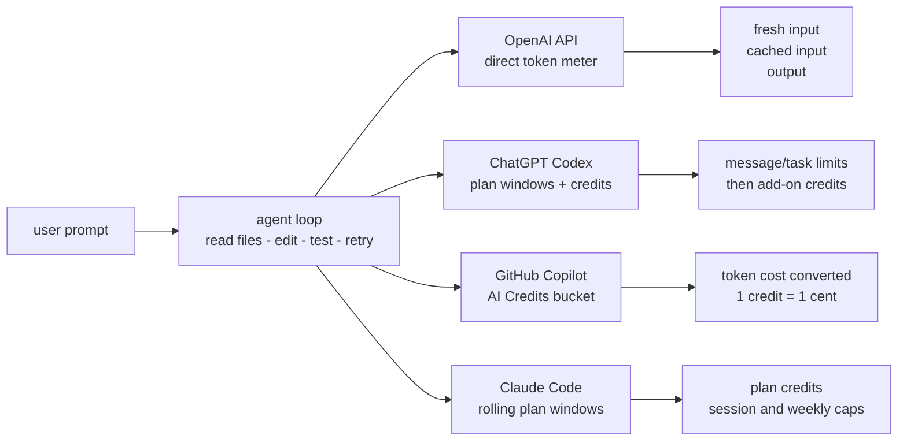
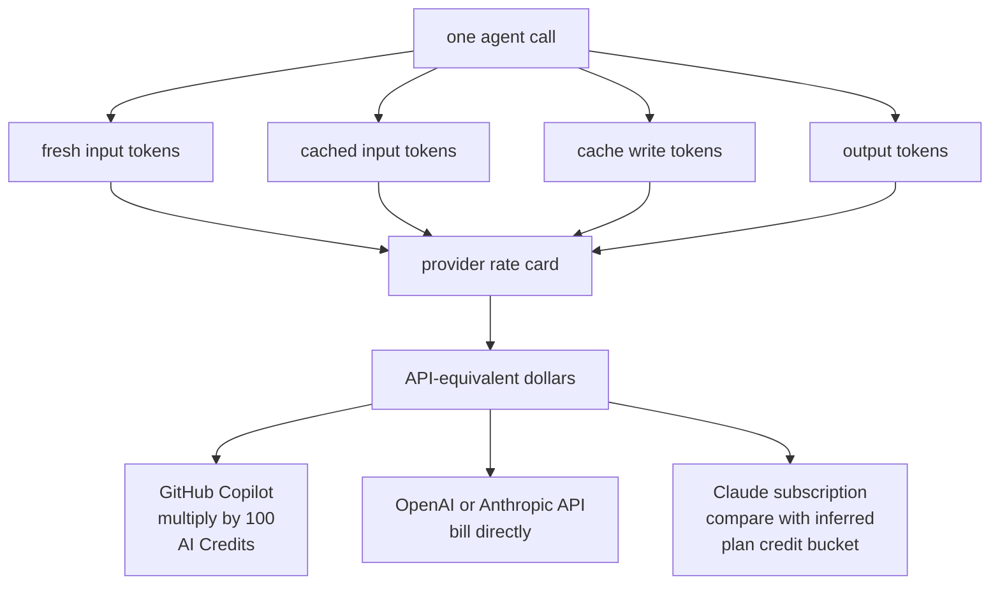
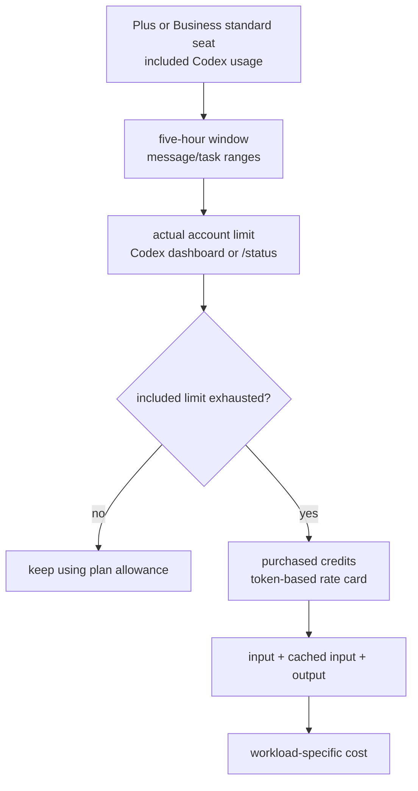
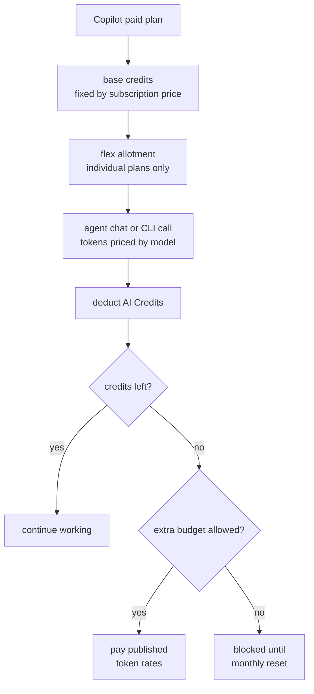
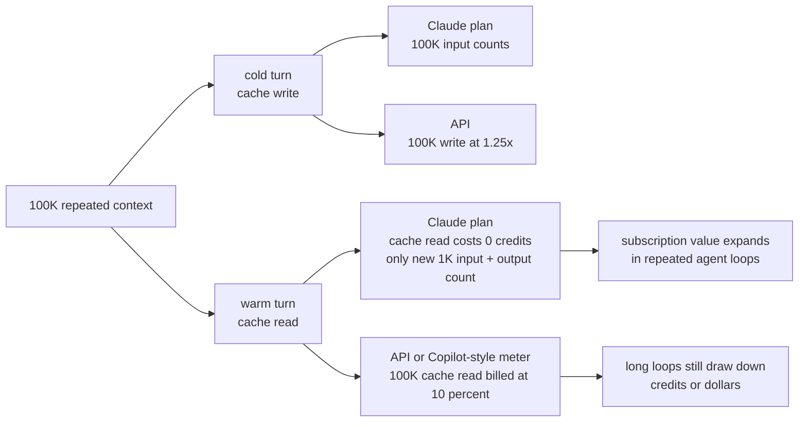

AI coding assistants have crossed an economic boundary. What began as cheap autocomplete and chat has become a set of long-running software agents that read repositories, edit files, run commands, inspect logs, retry failed tests, and sometimes work for hours from a single prompt.

That capability is useful, but it breaks the old pricing model. A flat $10 or $20 subscription can work for lightweight completions. It does not work when one developer can ask an agent to carry a large repository context through dozens of expensive model calls. In 2026, the market is moving from "all you can eat" AI coding to metered inference: tokens, credits, rolling limits, and model-specific usage rates.

This post distills my longer research note into a practical pricing comparison for developers and engineering leaders. The exact numbers will continue to move, so treat this as a May 2026 snapshot. The most important part is not the headline subscription price; it is the mapping from plan allowance to token budget.

## Why flat-fee AI coding broke

The first generation of AI coding subscriptions hid the real cost of inference. Vendors subsidized heavy users because the goal was adoption: get developers used to AI-assisted coding, make it part of the daily workflow, then improve the economics later.

Agentic coding changed the math. A normal chat request might send one prompt and receive one answer. An agentic session is a loop:

1. Read files.
2. Build a plan.
3. Edit code.
4. Run tests or commands.
5. Parse errors.
6. Re-read context.
7. Try again.

Each loop consumes input tokens, output tokens, tool schemas, system instructions, prior conversation history, and often repeated repository context. A single human instruction can become dozens of model invocations. The heavier the context window and the more capable the model, the more expensive the session becomes.

That is why vendors are correcting course. The new pricing story is no longer just "which assistant is smartest?" It is also "which assistant gives me the right cost controls for the kind of work I do?"

## The three pricing philosophies

The major platforms are converging on usage awareness, but they are not doing it in the same way.

| Platform | Pricing philosophy | Best fit | Main risk |
| :-- | :-- | :-- | :-- |
| **OpenAI API + ChatGPT Codex** | Raw token utility billing, or ChatGPT plan windows with add-on credits | Teams building custom tools, internal agents, CI automation, and developers using Codex through ChatGPT plans | API costs scale directly; ChatGPT Codex plan value depends on model mix and hidden account limits |
| **GitHub Copilot** | Subscription plus AI Credits / usage-based metering for premium and agentic work | Developers who want IDE-native workflows, GitHub integration, and enterprise pooling | Budget predictability declines as agent mode and code review usage grows |
| **Claude Code** | CLI subscription windows or direct API billing | Terminal-native developers who want strong agentic workflows and repository manipulation | Rolling limits interrupt work, while API mode can become expensive quickly |

The important distinction is not only the sticker price. It is where the platform places the economic guardrail. OpenAI exposes both a direct API token meter and a ChatGPT Codex plan/credit model. GitHub wraps usage in subscription credits. Anthropic uses rolling windows for subscriptions and direct token billing for API usage.



## How to translate a plan into tokens

To make the comparison concrete, I use three formulas throughout this post.

For API billing, the basic formula is:

```text
cost = (fresh_input_tokens * input_rate
	+ cached_input_tokens * cached_rate
	+ cache_write_tokens * cache_write_rate
	+ output_tokens * output_rate) / 1,000,000
```

Not every provider exposes every category. OpenAI pricing generally uses fresh input, cached input, and output. Anthropic API pricing also separates cache writes from cache reads, and cache writes are priced at a multiplier of base input tokens.<sup>[5](#ref-5)</sup>

For GitHub Copilot, the dollar cost is converted to GitHub AI Credits:

```text
GitHub AI Credits = API-equivalent dollar cost * 100
```

That is because 1 GitHub AI Credit equals $0.01 USD.<sup>[4](#ref-4)</sup>

For Claude subscriptions, the public product pages do not expose a direct token allowance. The best analysis I found is ShellaC's reverse-engineering of Claude's usage bars and SSE usage fractions.<sup>[9](#ref-9)</sup> In that analysis, Claude plan usage is tracked by an internal credit-like unit:

```text
Claude plan credits used = ceil(input_tokens * input_rate + output_tokens * output_rate)
```

The inferred model rates are:

| Claude model class | Input credit rate | Output credit rate | Relative meaning |
| :-- | --: | --: | :-- |
| **Haiku** | 2/15 = 0.133 credits/token | 10/15 = 0.667 credits/token | Cheapest |
| **Sonnet** | 6/15 = 0.400 credits/token | 30/15 = 2.000 credits/token | Middle |
| **Opus** | 10/15 = 0.667 credits/token | 50/15 = 3.333 credits/token | Most expensive |

This mirrors Anthropic API pricing ratios: output is roughly 5x input, and Opus is much more expensive than Haiku. The crucial difference is caching. On the Claude API, cache reads cost 10% of the input price. In ShellaC's observed Claude subscription accounting, cache reads do not consume plan credits, while cache writes count like regular input tokens.<sup>[9](#ref-9)</sup>

To compare providers, I will use one reference workload for OpenAI and Copilot:

```text
One reference agent model call = 100K cached input + 10K fresh input + 2K output
```

That is not a whole coding session. It is one model call inside an agent loop. A real agent task may use 10, 25, or 50+ calls depending on how many files it reads, how many tests it runs, and how often it retries.



## OpenAI: utility pricing and model routing

OpenAI's model is closest to cloud infrastructure pricing. You choose a model, send tokens, receive tokens, and pay according to the model's rate card. Higher-capability reasoning models cost more, while lighter models are cheaper and better suited for fast or repetitive tasks.

The practical implication is that teams should stop thinking in terms of "one model for coding". A modern AI coding stack needs routing:

| Task type | Good routing choice | Why |
| :-- | :-- | :-- |
| Inline completion, small snippets, regex help | Small / fast coding model | Low latency and low cost matter more than deep reasoning |
| Unit test generation or documentation | Mid-tier model | Needs context, but usually not the most expensive reasoning path |
| Multi-file refactor | Agent-oriented coding model | Needs repository awareness and long-horizon task execution |
| Architecture review, hard debugging, concurrency bugs | Frontier reasoning model | Quality can justify the premium when mistakes are expensive |
| Bulk offline work such as documentation sweeps | Batch or lower-priority processing | Latency is less important than cost |

OpenAI also offers cost levers that matter a lot for coding agents: prompt caching, batch processing, lower-priority routing, and hosted execution environments for code verification.<sup>[1](#ref-1)</sup> The lesson is simple: if you consume OpenAI directly, you need engineering discipline around prompts, cacheable prefixes, context pruning, and routing. Otherwise, the bill becomes a debugging artifact.

Here is what the math looks like for a $10 API budget using the reference agent model call above:

| OpenAI model | Rates: input / cached / output | What $10 buys if all one token type | Cost per reference call | Calls per $10 |
| :-- | :-- | :-- | --: | --: |
| **GPT-5.5** | $5.00 / $0.50 / $30.00 per 1M tokens | 2.0M input, 20.0M cached input, or 0.33M output | $0.160 | 62 |
| **GPT-5.4** | $2.50 / $0.25 / $15.00 per 1M tokens | 4.0M input, 40.0M cached input, or 0.67M output | $0.080 | 125 |
| **GPT-5.3-Codex** | $1.75 / $0.175 / $14.00 per 1M tokens | 5.71M input, 57.1M cached input, or 0.71M output | $0.063 | 158 |
| **GPT-5.4 mini** | $0.75 / $0.075 / $4.50 per 1M tokens | 13.3M input, 133.3M cached input, or 2.22M output | $0.024 | 416 |

The spread is large. With the same $10, the reference workload runs about 62 GPT-5.5 calls or 416 GPT-5.4 mini calls. If a coding session takes 25 model calls, that is roughly $4.00 on GPT-5.5, $1.58 on GPT-5.3-Codex, or $0.60 on GPT-5.4 mini. This is why model routing is not a nice-to-have; it is the cost model.

## OpenAI Codex through ChatGPT plans: validated vs inferred

OpenAI's Codex pricing page adds a second OpenAI path that is easy to confuse with API billing: sign in to Codex with a ChatGPT plan rather than an API key. In that mode, Codex is included in ChatGPT Free, Go, Plus, Pro, Business, Edu, and Enterprise plans, with Plus, Pro, and Business exposing plan-based usage limits and optional purchased credits after the included limits are exhausted.<sup>[13](#ref-13)</sup>

Here is what the public Codex page validates directly for Plus and Business standard seats:

| Plan | Published price | Published Codex allowance shape | Notes |
| :-- | --: | :-- | :-- |
| **ChatGPT Plus** | $20/month | Included Codex usage with five-hour local/cloud-task windows | Individual plan |
| **ChatGPT Business standard seat** | $25/user/month monthly, or $20/user/month annually | Baseline access to Codex with the same per-seat usage-limit table as Plus | Minimum 2 standard seats |
| **Business Codex seat** | $0 fixed seat fee | No included usage; activity requires purchased workspace credits | Codex-only, usage-based |
| **ChatGPT Pro $100** | $100/month | Standard 5x Plus Codex usage; 10x Plus through May 31, 2026 promo | Individual plan |
| **ChatGPT Pro $200** | $200/month | 20x Plus; temporary 25x five-hour Codex limits through May 31, 2026 | Heavy-use plan |

The Business standard-seat pricing and the distinction between fixed-cost ChatGPT seats and $0 fixed-cost Codex-only seats are described in OpenAI's ChatGPT Business docs.<sup>[16](#ref-16)</sup>

The Plus and Business usage-limit table is expressed as messages or tasks, not dollars:

| Model | Local messages / 5h | Cloud tasks / 5h | Code reviews / 5h |
| :-- | --: | --: | --: |
| **GPT-5.5** | 15-80 | Not available | Not available |
| **GPT-5.4** | 20-100 | Not available | Not available |
| **GPT-5.4-mini** | 60-350 | Not available | Not available |
| **GPT-5.3-Codex** | 30-150 | 10-60 | 20-50 |

OpenAI says local-message and cloud-task usage share the same five-hour window, and that additional weekly limits may apply.<sup>[13](#ref-13)</sup> That wording matters: the public page validates the five-hour ranges above, but it does **not** publish a stable weekly or monthly dollar-equivalent allowance. The Codex usage dashboard and `/status` command are the source of truth for a specific account.

For token-based purchased-credit usage, OpenAI publishes this Codex rate card:<sup>[14](#ref-14)</sup>

| Codex model | Input / 1M tokens | Cached input / 1M tokens | Output / 1M tokens |
| :-- | --: | --: | --: |
| **GPT-5.5** | 125 credits | 12.50 credits | 750 credits |
| **GPT-5.4** | 62.50 credits | 6.250 credits | 375 credits |
| **GPT-5.4-mini** | 18.75 credits | 1.875 credits | 113 credits |
| **GPT-5.3-Codex** | 43.75 credits | 4.375 credits | 350 credits |

So how should we treat the claim that Plus or Business gives "about $12 of tokens per five-hour window, $72 per week, and $284 per month"? I would not write it as an official OpenAI number. The official docs validate the five-hour message/task ranges and the token-based purchased-credit rate card, but they do not publish a fixed weekly or monthly dollar-equivalent allowance.

The most defensible version is:

> Based on community conversions of the published five-hour message ranges into add-on-credit equivalents, Plus and Business standard seats can plausibly feel like roughly **$10-$15 of Codex add-on-credit-equivalent usage per five-hour window** for some higher-end local, cloud, or review workflows. Some users extrapolate that to roughly **$70/week** and **$280-$300/month** of add-on-credit-equivalent capacity, but OpenAI does not publish those weekly/monthly dollar equivalents and the real value depends heavily on model choice, prompt size, cached context, output length, and account-specific limits.

One way to sanity-check the range is to look at the legacy average message-card values that OpenAI still documents for planning: GPT-5.5 local tasks were around 14 credits per message, GPT-5.4 around 7, GPT-5.3-Codex around 5 for local tasks, and GPT-5.3-Codex cloud tasks or code reviews around 25 credits each.<sup>[13](#ref-13)</sup> Multiplying those by the Plus/Business five-hour ranges gives a very wide band: GPT-5.5 local usage maps to roughly 210-1,120 credits per five hours, while GPT-5.3-Codex cloud tasks map to roughly 250-1,500 credits. That makes a "roughly $12" five-hour conversion plausible under common community assumptions, but not universal.

That caveat is not pedantry. The official table says GPT-5.5 local messages can range from 15 to 80 in the same five-hour window. If you model a GPT-5.5 prompt at about $0.90 of purchased-credit-equivalent usage, the low end is about $13.50 and the high end is $72. If you model the prompt at a lower effective cost, the same window looks much cheaper. The answer is therefore not one number; it is a workload distribution.

The general efficiency conclusion does survive the caveat: included plan usage is much cheaper than buying all usage as add-on credits. If a $20 Plus seat behaves like roughly $280/month of add-on-credit-equivalent Codex capacity for your workload, then buying your way to the same usage would be about **14x** the subscription price. For a $25 monthly Business standard seat, the ratio is about **11x**. That is the basis for the "credits are around 10x more expensive than relying on built-in plan usage" rule of thumb, but I would present it as an order-of-magnitude estimate, not a guaranteed multiplier.



There is one more validated recommendation: be careful with Fast mode. Codex Fast mode increases supported model speed by 1.5x, but it consumes credits at a higher rate: **2.5x standard for GPT-5.5** and **2x standard for GPT-5.4**.<sup>[15](#ref-15)</sup> So the practical advice is: leave Fast mode off by default unless latency is worth the burn rate. If you are regularly hitting usage limits, Fast mode is usually the first thing to disable.

The commonly quoted prompt-level estimates -- GPT-5.5 xHigh around $1.30/prompt, GPT-5.5 High around $0.90/prompt, and GPT-5.4 High around $0.43/prompt -- are useful as field estimates, but I would not cite them as official pricing. They appear to come from scattered user measurements and can vary dramatically with repository size, reasoning effort, prompt simplicity, context reuse, output length, and whether Fast mode is enabled. Treat them as starting calibration points and measure your own workload.

## GitHub Copilot: from subscription comfort to AI Credits

GitHub Copilot is the most familiar product for many developers, and its pricing transition is therefore the most visible. GitHub announced a move toward usage-based billing for Copilot, particularly for premium model and agentic workloads.<sup>[2](#ref-2)</sup>

The new pattern is a hybrid subscription model. Paid plans include a monthly allocation of GitHub AI Credits, where credits map back to the underlying model usage. In the individual plan structure, GitHub separates included usage into base credits and flex allotments.<sup>[3](#ref-3)</sup>

| Copilot plan | Monthly price | Base credits | Flex allotment | Total monthly credits | Dollar-equivalent usage |
| :-- | --: | --: | --: | --: | --: |
| **Pro** | $10 | 1,000 | 500 | 1,500 | $15 |
| **Pro+** | $39 | 3,900 | 3,100 | 7,000 | $70 |
| **Max** | $100 | 10,000 | 10,000 | 20,000 | $200 |
| **Business** | $19/user | 1,900/user | N/A | Pooled at organization level | $19/user |
| **Enterprise** | $39/user | 3,900/user | N/A | Pooled at organization level | $39/user |

The subtle but important change is that not all Copilot activity has the same economic weight. Inline completions and lightweight suggestions can remain effectively unmetered or bundled because they run on optimized paths. Agent mode, premium chat, code review, and cloud workspace behavior are much more expensive because they rely on larger models and more context.

For enterprises, pooling credits across users is helpful because not every developer is a power user every day. Existing Copilot Business and Enterprise customers also receive promotional included usage during the initial transition period: 3,000 credits per Business seat and 7,000 credits per Enterprise seat before returning to the standard 1,900 and 3,900 credit allowances.<sup>[10](#ref-10)</sup> But pooling does not eliminate the need for governance. Automated reviews, background agents, and CI-linked workflows can consume both AI credits and ordinary build infrastructure such as GitHub Actions minutes.<sup>[4](#ref-4)</sup>

Now map that to tokens. Using GPT-5.3-Codex inside Copilot, the reference call costs:

```text
100K cached input * $0.175/M = $0.0175
 10K fresh input  * $1.75/M  = $0.0175
	2K output       * $14/M    = $0.0280
Total = $0.063 = 6.3 GitHub AI Credits
```

That gives the following rough budget:

| Copilot allowance | Included usage | GPT-5.3-Codex reference calls | Approx. 25-call agent sessions |
| :-- | --: | --: | --: |
| **Pro** | $15 / 1,500 credits | 238 | 9 |
| **Pro+** | $70 / 7,000 credits | 1,111 | 44 |
| **Max** | $200 / 20,000 credits | 3,174 | 126 |
| **Business standard per-seat pool contribution** | $19 / 1,900 credits | 301 | 12 |
| **Enterprise standard per-seat pool contribution** | $39 / 3,900 credits | 619 | 24 |

This is why Copilot's Max plan can be attractive for sustained agent use: its headline price is $100, but the included AI Credit value is $200. It is also why model choice matters. If the same task runs on GPT-5.5, the reference call costs 16 credits instead of 6.3; the Pro plan's 1,500 credits fall from 238 calls to about 93 calls. If it runs on GPT-5.4 mini, the same plan stretches to about 625 calls.



## Claude Code: productive CLI, hard limits

Claude Code has a different feel. It is less like an IDE feature and more like an agentic command-line collaborator. It can inspect a repo, run shell commands, edit files, and iterate in the terminal. That makes it powerful for focused engineering sessions.

Anthropic's subscription model uses rolling usage windows rather than a simple monthly token bucket. The benefit is predictable vendor exposure and some protection against runaway usage. The drawback is obvious to anyone who has hit the limit mid-refactor: your work can stop because the time window is exhausted.<sup>[5](#ref-5)</sup>

Claude Code can also be connected directly to API billing. That removes subscription interruptions, but it moves the risk to your wallet. Long agent loops are especially dangerous because the agent may repeatedly resubmit large context windows while debugging the same issue. Without compaction and pruning, repeated context becomes token waste.

| Claude Code path | Benefit | Tradeoff |
| :-- | :-- | :-- |
| Subscription plan | Predictable monthly spend and built-in limits | Rolling windows can interrupt deep work |
| API billing | No artificial session lockout | Costs can spike during long agent loops |
| Team / Enterprise plan | More usage, admin controls, compliance features | Higher baseline seat cost |

Anthropic's official pages explain the plan names and that limits depend on message length, attachments, conversation length, tool usage, model choice, and artifacts.<sup>[11](#ref-11)</sup> They do not publish a simple token-per-plan table. ShellaC's reverse-engineered numbers fill that gap. Treat the following as an unofficial but useful model, not an Anthropic contract.

| Claude plan | Price | Inferred 5-hour session credits | Inferred weekly credits | Monthly credits equivalent | Opus token equivalent | API-equivalent value |
| :-- | --: | --: | --: | --: | :-- | --: |
| **Pro** | $20/mo | 550,000 | 5,000,000 | 21.7M | 32.5M input or 6.5M output | ~$163, or 8.1x plan price |
| **Max 5x** | $100/mo | 3,300,000 | 41,666,700 | 180.6M | 270.8M input or 54.2M output | ~$1,354, or 13.5x plan price |
| **Max 20x** | $200/mo | 11,000,000 | 83,333,300 | 361.1M | 541.7M input or 108.3M output | ~$2,708, or 13.5x plan price |

Two things stand out.

First, Max 5x is the sweet spot if you care about monthly value. It costs 5x Pro, but the inferred weekly credit limit is about 8.33x Pro. Second, Max 20x is mainly about burst capacity in the five-hour window. Its session ceiling is 20x Pro, but its weekly ceiling is only 2x Max 5x. If you need all-day heavy usage, Max 20x helps; if you only compare monthly API-equivalent value per dollar, Max 5x is hard to beat.

The cache behavior is the real economic surprise. Consider Opus with a large repeated context.

### Claude cold-cache example

One cold request writes 100K tokens into cache and produces 1K output tokens:

```text
Subscription credits = ceil(100K * 2/3 + 1K * 10/3) = 70,000 credits

API cost:
100K cache write * $5/M * 1.25 = $0.625
	1K output      * $25/M       = $0.025
Total = $0.650
```

On Max 5x, the inferred weekly credit bucket supports about 595 such requests. At API rates, that would be about $386.75 per week, or roughly $1,676 per month. Compared with the $100 Max 5x plan, that is about 16.8x API-equivalent value.

### Claude warm-cache example

Now assume the same 100K context is already warm, and each following turn adds only 1K new input plus 1K output:

```text
Subscription credits = ceil(1K * 2/3 + 1K * 10/3) = 4,000 credits

API cost:
100K cache read  * $5/M * 0.1  = $0.05000
	1K cache write * $5/M * 1.25 = $0.00625
	1K output      * $25/M       = $0.02500
Total = $0.08125
```

On the API, warm-cache turns still cost money because cache reads are billed at 10% of input. In the subscription accounting observed by ShellaC, cache reads consume no plan credits. Max 5x therefore supports about 10,416 warm-cache requests per week in this scenario. The API-equivalent value is roughly $3,667 per month, or 36.7x the $100 subscription price.

This explains why Claude Code feels dramatically cheaper on a subscription than through direct API billing for long, repeated-context sessions. It also explains the limits: Anthropic must cap the rolling windows because warm agent loops can otherwise create enormous effective API value.



It also makes Claude-via-Copilot meaningfully different from Claude-native subscriptions. The warm Opus example above costs $0.08125, or 8.125 GitHub AI Credits, under API-style accounting. Copilot Max's $200 monthly credit allowance would cover about 2,461 such calls per month. The inferred Claude Max 5x subscription bucket supports about 10,416 such calls per week, or roughly 45,000 per month, because the 100K cache read does not drain subscription credits. That is not an apples-to-apples product comparison, but it is the clearest reason Claude Code subscriptions can outperform API or Copilot-style metering for repeated-context Claude workloads.

If your workflow is terminal-first and you value strong autonomous editing, Claude Code is compelling. But it rewards disciplined session management: compact context, avoid unnecessary file dumps, terminate idle agents, and route routine tasks to cheaper models where possible.<sup>[6](#ref-6)</sup> Claude's own support docs make the same operational point: clear between unrelated tasks, use `/compact` during long tasks, avoid pasting entire files when a path will do, keep `CLAUDE.md` lean, and reserve Opus for planning or truly hard problems.<sup>[12](#ref-12)</sup>

## The pros and cons of token-based billing

Usage-based pricing is not purely bad. It fixes real problems, especially for vendors and light users. But it creates new psychological and operational costs for development teams.

### What gets better

**Vendor economics become sustainable.** Providers no longer need light users to subsidize the heaviest agentic sessions. Revenue tracks compute cost more closely.

**Power users can run bigger jobs.** Instead of being blocked by hidden limits, teams can choose to pay for large refactors, migration work, or security sweeps when the business value is clear.

**Bursty teams may pay more fairly.** A developer who uses AI heavily during one sprint and barely at all during another can benefit from usage alignment, assuming the platform exposes useful spending controls.

### What gets worse

**Budgets become less predictable.** A runaway agent can turn a simple ticket into a surprisingly expensive session, especially with large context windows and high-output models.<sup>[7](#ref-7)</sup>

**Developers feel meter anxiety.** When every prompt has a visible cost, experimentation feels less free. That can reduce the creative trial-and-error that made these tools valuable in the first place.

**Engineering teams inherit a new operations problem.** Developers now need to think about model choice, prompt shape, cache behavior, context size, and cost telemetry. That is cloud cost management all over again, but inside the software development loop.

## A practical cost-control playbook

The answer is not to stop using AI coding agents. The answer is to treat inference as an engineering resource.

### 1. Make prompts cache-friendly

Prompt caching works best when the beginning of the prompt stays stable. Put static instructions first: repository rules, tool definitions, coding standards, and durable architecture notes. Put dynamic content later: the specific user request, fresh logs, current error output, and temporary file snippets.

This is the "layer cake" pattern:

1. Static system and repo instructions.
2. Semi-static project context.
3. Retrieved files or relevant snippets.
4. The current task and latest error output.

Changing the top of the prompt breaks exact-prefix caching. Keeping the prefix stable lets providers reuse cached input at a discount or avoid repeated processing.<sup>[8](#ref-8)</sup>

### 2. Prune context aggressively

The most expensive token is the token you did not need to send. Avoid dumping entire repositories into context. Prefer search, retrieval, and small relevant snippets. In long sessions, periodically compact the conversation into a concise state summary and clear stale history.

Good context management answers three questions:

| Question | Why it matters |
| :-- | :-- |
| What does the model need to know now? | Keeps the prompt focused |
| What can be retrieved later if needed? | Avoids paying repeatedly for cold context |
| What is stale or already resolved? | Prevents the context window from becoming a landfill |

This is especially important for agents because each retry can carry forward prior messages, tool schemas, logs, and file content.

### 3. Route by task, not by habit

Using the strongest model for every request is like compiling a hello-world program on a supercomputer. Sometimes justified, usually wasteful.

Create a routing policy:

| Use this model class | For these tasks |
| :-- | :-- |
| Local model | Formatting, log cleanup, simple scripts, regexes, boilerplate |
| Small cloud model | Autocomplete, short code snippets, simple tests |
| Mid-tier coding model | Routine feature work, test generation, explanation |
| Frontier reasoning model | Ambiguous architecture, difficult debugging, security-sensitive changes |

Local models through tools like Ollama or LM Studio can handle many low-risk tasks with zero marginal token cost. Paid frontier models should be reserved for the places where reasoning quality matters.

### 4. Put budgets and alerts near the workflow

Cost controls work best when they are visible where developers work. Useful controls include:

* Per-user and per-team monthly budgets.
* Soft warnings before hard limits.
* Per-session cost estimates.
* Model-level usage reports.
* CI cost attribution for AI code review and agent runs.
* Kill switches for runaway background agents.

The goal is not to shame developers for using AI. The goal is to make expensive behavior observable before it surprises finance.

### 5. Standardize agent operating procedures

Teams should document how they expect agents to be used. For example:

* Start with a small investigation prompt before asking for code changes.
* Ask the agent to explain the file set it needs before loading large context.
* Prefer targeted diffs over broad rewrites.
* Run tests locally before asking the agent to retry repeatedly.
* Compact or restart long sessions after a major milestone.
* Escalate to a larger model only after a smaller one fails for a clear reason.

These habits sound small, but they compound quickly across a team.

## Conclusion: optimized intelligence wins

The era of free or heavily subsidized coding intelligence is ending. That does not mean AI coding tools are becoming less useful. It means they are becoming real infrastructure.

The teams that benefit most from AI coding in 2026 will not simply be the teams with access to the best model. They will be the teams that understand the token economy: cache static context, prune aggressively, route intelligently, monitor spending, and teach developers how to work with agents without turning every task into an open-ended inference loop.

AI coding used to be priced like a gym membership. Increasingly, it is priced like cloud computing. The sooner engineering teams treat it that way, the less painful the transition will be.

#### Works cited

1. <a id="ref-1"></a>OpenAI API Pricing, accessed May 14, 2026, [https://openai.com/api/pricing/](https://openai.com/api/pricing/)  
2. <a id="ref-2"></a>GitHub Copilot is moving to usage-based billing, accessed May 14, 2026, [https://github.blog/news-insights/company-news/github-copilot-is-moving-to-usage-based-billing/](https://github.blog/news-insights/company-news/github-copilot-is-moving-to-usage-based-billing/)  
3. <a id="ref-3"></a>GitHub Copilot individual plans: Introducing flex allotments in Pro and Pro+, and a new Max plan, accessed May 14, 2026, [https://github.blog/news-insights/company-news/github-copilot-individual-plans-introducing-flex-allotments-in-pro-and-pro-and-a-new-max-plan/](https://github.blog/news-insights/company-news/github-copilot-individual-plans-introducing-flex-allotments-in-pro-and-pro-and-a-new-max-plan/)  
4. <a id="ref-4"></a>Models and pricing for GitHub Copilot, accessed May 14, 2026, [https://docs.github.com/copilot/reference/copilot-billing/models-and-pricing](https://docs.github.com/copilot/reference/copilot-billing/models-and-pricing)  
5. <a id="ref-5"></a>Pricing - Claude API Docs, accessed May 15, 2026, [https://platform.claude.com/docs/en/about-claude/pricing](https://platform.claude.com/docs/en/about-claude/pricing)  
6. <a id="ref-6"></a>Manage costs effectively - Claude Code Docs, accessed May 14, 2026, [https://code.claude.com/docs/en/costs](https://code.claude.com/docs/en/costs)  
7. <a id="ref-7"></a>The Hidden Cost Driver in Agentic Coding Sessions in 2026, accessed May 14, 2026, [https://www.vantage.sh/blog/agentic-coding-costs](https://www.vantage.sh/blog/agentic-coding-costs)  
8. <a id="ref-8"></a>Improving token efficiency in GitHub Agentic Workflows, accessed May 14, 2026, [https://github.blog/ai-and-ml/github-copilot/improving-token-efficiency-in-github-agentic-workflows/](https://github.blog/ai-and-ml/github-copilot/improving-token-efficiency-in-github-agentic-workflows/)  
9. <a id="ref-9"></a>suspiciously precise floats, or, how I got Claude's real limits, accessed May 15, 2026, [https://she-llac.com/claude-limits](https://she-llac.com/claude-limits)  
10. <a id="ref-10"></a>Usage-based billing for organizations and enterprises - GitHub Docs, accessed May 15, 2026, [https://docs.github.com/en/copilot/concepts/billing/usage-based-billing-for-organizations-and-enterprises](https://docs.github.com/en/copilot/concepts/billing/usage-based-billing-for-organizations-and-enterprises)  
11. <a id="ref-11"></a>Usage limit best practices - Claude Help Center, accessed May 15, 2026, [https://support.claude.com/en/articles/9797557-usage-limit-best-practices](https://support.claude.com/en/articles/9797557-usage-limit-best-practices)  
12. <a id="ref-12"></a>Models, usage, and limits in Claude Code - Claude Help Center, accessed May 15, 2026, [https://support.claude.com/en/articles/14552983-models-usage-and-limits-in-claude-code](https://support.claude.com/en/articles/14552983-models-usage-and-limits-in-claude-code)
13. <a id="ref-13"></a>Codex Pricing - OpenAI Developers, accessed May 15, 2026, [https://developers.openai.com/codex/pricing](https://developers.openai.com/codex/pricing)  
14. <a id="ref-14"></a>Codex rate card - OpenAI Help Center, accessed May 15, 2026, [https://help.openai.com/en/articles/20001106-codex-rate-card](https://help.openai.com/en/articles/20001106-codex-rate-card)  
15. <a id="ref-15"></a>Speed - Codex - OpenAI Developers, accessed May 15, 2026, [https://developers.openai.com/codex/speed](https://developers.openai.com/codex/speed)  
16. <a id="ref-16"></a>What is ChatGPT Business? - OpenAI Help Center, accessed May 15, 2026, [https://help.openai.com/en/articles/8792828-what-is-chatgpt-business](https://help.openai.com/en/articles/8792828-what-is-chatgpt-business)