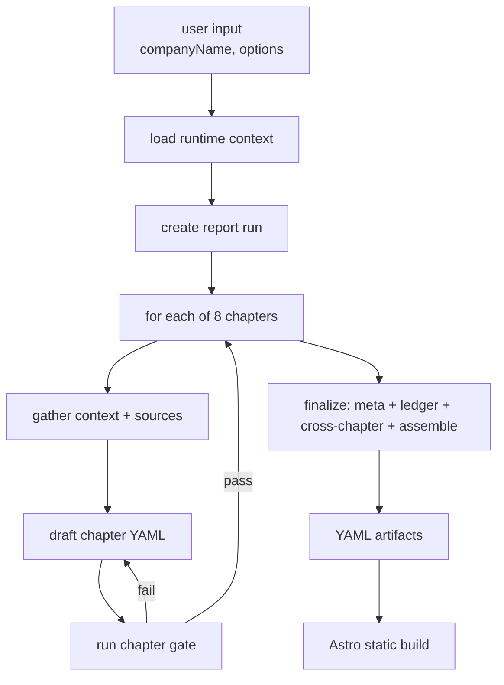
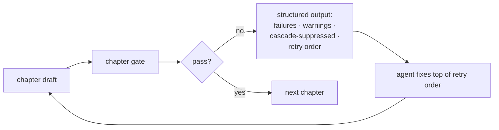
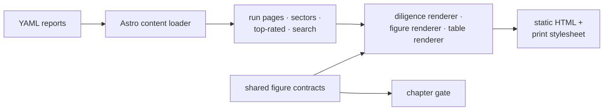

# Harness Engineering: Shipping a Self-Validating Research Pipeline With Coding Agents

> A walk-through of the design behind [`startup.genisisiq.com`](https://startup.genisisiq.com): a pipeline where a coding agent end-to-end generates, validates, assembles and renders structured diligence reports on private and public companies. As of writing, the site holds **46 complete reports**, backed by roughly **9,400 cited sources** and **14,400 atomic claims** — all produced autonomously, none manually transcribed.

## What the site is

`startup.genisisiq.com` is a structured library of early- and growth-stage company research. Every report covers the same eight chapters — Company Overview, Market, Competitors, Financials, Product & Technology, Customers, Risks, Valuation — and each chapter is rendered from a strict YAML schema rather than free-form prose.

Every claim in a report carries an inline reference like `[CO012]` that resolves to a specific source, with a quoted excerpt and a canonical URL. Open any report (say OpenAI or Anthropic), toggle the reference visibility, and you can walk the entire chain from "this company has X ARR" all the way down to the filing or interview that the number came from.

The crucial property: **content is generated by an agent, but the website itself never calls an LLM.** All model output is structured, validated, and frozen into deterministic YAML during generation. The site is a static Astro build over those YAML files. No SSR, no inference at request time, no hallucination at the rendering edge.

## The mental model: don't ask the agent to "write a report"

I don't ask the agent to write a report. I ask it to **run a pipeline**. That distinction does most of the work.

Every step the agent takes is bound to a specific command, a specific schema, and a specific set of failure modes with one-line fixes. The instruction surface the agent reads is tiny — under a hundred lines — because all the policy lives in config files that the loader projects into a runtime context for each chapter. The agent never has to "remember" the rules; it re-reads them every loop.

## YAML as the world model

The first design decision worth defending: every report is a typed YAML dataset, not a markdown document. A schema defines:

- The artifact envelope (`schemaVersion`, `slug`, `runDate`, `company`, ...).
- An ID grammar where every claim, source, table, figure and callout has a stable identifier.
- Roughly two dozen controlled vocabularies — source type, stance, claim type, figure type, recommendation, callout type — that the validator enforces.
- A renderer contract for each figure type (a timeline must have items; a DAG must have nodes and edges; a bar chart must have items and series).
- A shared regex for inline claim references like `[CO045]`, used by both the validator and the website.

The pay-off is immediate:

1. The agent **cannot bullshit silently**. Writing `confidence: very-high` fails the chapter gate and surfaces a one-line fix: *"use a value from the allowed enum."*
2. The renderer doesn't need a defensive layer. It can assume figure shapes are valid; bugs surface at validation time, not as silently broken pages.
3. All 46 reports are isomorphic, which makes cross-company aggregation, sector indexes, and "top-rated" rollups trivial.
4. A CI step replays every historical report through the current schema. A breaking change can't quietly corrupt yesterday's work.

## Workflow as configuration, not prompt

The "constitution" of the pipeline lives in a single workflow config file. It is simultaneously:

- The **agent's brief** — chapter descriptions, planned tables and figures, content requirements, evidence strategy, quality bar.
- The **validator's rulebook** — per-chapter and per-report gates: minimum sources, minimum distinct domains, minimum corroborated high-confidence claims, paywall ratio caps, adverse-source distribution.
- A set of **agent policies** — research rules, hard rules, retry policy, treatment of volatile facts.

Two consequences. First, when I want to raise the bar on a chapter — say, require at least one filing-type source in financials — I edit one line and the next agent loop sees the new rule. Second, the markdown the agent reads contains zero policy. It just tells the agent: *"run the loader, read the runtime context, follow it."* This eliminates the classic three-way drift where the docs say one thing, the config says another, and the agent invents a third.

## Why I rewrote the URL fetcher

Off-the-shelf "fetch a URL and give me text" tools handle blog posts. They do not handle the long tail of diligence sources: SEC filings, paywalled news sites with cookie walls, anti-bot shields, multi-hundred-page PDFs, product pages that require specific request fingerprints to return the real HTML.

The dominant failure mode is silent: the tool returns 200 OK, but the body is a cookie-consent interstitial. The agent dutifully treats that interstitial as evidence.

So the fetch layer became its own focused tool. Behind a single command, it does:

- **Browser fingerprint rotation** — multiple TLS/HTTP/2 identity profiles, picking the one most likely to succeed for a given host.
- **Per-host fast-paths** — a cache of known-good profile choices for hundreds of frequently-cited domains, with sensible fallbacks across host aliases.
- **Reader and archive fallbacks** — if the origin truly refuses, drop to a reader proxy, then to the Wayback Machine.
- **First-class PDF handling** — magic-byte detection, pipe through a text extractor, return clean text. SEC filings and prospectuses come back in one call.
- **Boilerplate stripping** — remove cookie banners, newsletter modals, related-article rails by default; expose a flag for product and pricing pages where the chrome *is* the content.
- **Disk cache with TTL** — the same URL referenced from multiple chapters in a run isn't fetched twice.
- **Structured JSON output** — the agent gets typed fields (`status`, `finalUrl`, `contentType`, `extractionMode`, `truncated`, `output`), not a blob of rendered markdown to re-parse.

The design taste here is intentional: **one default command plus a handful of escape hatches**, not a buffet of equivalent options. An agent's attention is a token budget. Every parallel path is a chance to choose wrong.

## Harness engineering: putting the agent in a well

This is the part of the design I care most about. An LLM is a strong but easily-distracted executor. The trick is to surround it with deterministic code that makes its mistakes legible and its corrections cheap.

There are four levers that make this loop work in practice.

**1. Stable failure dimensions.** The chapter validator does not return prose. It returns structured entries keyed on a fixed enum of around 50 failure dimensions — things like `highConfidenceCorroboration`, `tableShape`, `claimRefMissing`, `paywallRisk`, `localEvidenceMissing`. The agent can switch on the dimension; it never has to NLP-parse the message.

**2. One-line fixes per dimension.** Every dimension is registered with a short, executable suggestion. Many are templated and back-fill specifics from the failure context: not *"add more sources"* but *"add 2 more sources, including a primary-tier one."* The instructions don't carry a duplicated "fix table" — the validator owns it.

**3. Cascade suppression.** If a YAML file fails to parse, almost everything downstream will fail too. So the validator marks a small number of failures as **root causes** and suppresses their derivative dimensions, listing them separately as *"these will retest automatically once the root cause is fixed."* The agent sees one bug to fix, not fifty echoes of the same bug.

**4. Retry precedence.** Whatever's left is sorted into a `retryOrder` from upstream causes (schema, source/claim shape) to downstream concerns (corroboration, depth, references). The agent fixes top-down, never re-breaking what it just resolved.

A few smaller, but high-leverage, additions:

- **Object-level aggregation.** Two problems on the same table get bucketed into one item ("table T102 has 2 problems") instead of two free-floating entries.
- **Global hints.** When the same dimension fires on three or more objects, a chapter-wide hint surfaces so the agent fixes the pattern, not the symptom.
- **Acknowledged warnings.** Some warnings are legitimately context-dependent (paywall risk, missing notes). The agent can dismiss them with a written justification instead of inventing content to satisfy them.
- **Multiple output formats.** Plain text for humans; compact, grep-friendly output for shell loops; JSON for programmatic consumption.
- **Fail-safe retry budget.** A simple invariant — *each retry must strictly reduce the failure count* — kills the "fix one, break one" oscillation without any clever heuristics.

The net effect: the agent stops freelancing and starts behaving like a junior engineer reading a CI report.

## Versioned reports

Diligence content goes stale, so each report carries a small revision graph. A refresh run produces a new report folder; the new and old reports point at each other through symmetric pointers; a validator catches dangling and self-referential edges. The site renders a banner at the top of any report that has been refreshed or superseded, with a link to the current version. Diligence becomes auditable over time, not a single snapshot.

## Adverse-evidence distribution

A subtle gate worth calling out. The simple version of "include adverse evidence" is *"at least one adverse source somewhere in the report."* That's gameable — the agent will dump everything into the Risks chapter and call it done. So the report-level gate enforces adverse coverage **per chapter** for the chapters where it matters: Company Overview, Financials, Customers, Valuation. This single change made the reports noticeably more honest.

## The website is intentionally boring

A few details I'm fond of:

- **The renderer contract is the same file the validator imports.** Adding a new figure type changes one location; the validator and the renderer learn about it simultaneously. They cannot drift.
- **Inline claim refs share a regex source with the validator.** The website renders `[CO045]` as an anchor link; toggling a single class shows or hides every reference at once.
- **A4 print pipeline using only the browser.** Native `window.print()` plus CSS Paged Media gives clean PDFs — page numbers, repeating headers, no broken tables — without Puppeteer or a server.
- **No database, no SSR, no runtime LLM.** Static HTML + CDN. The semantic content is decided at build time.

## What I'd take away from this build

Three sentences.

1. **YAML is the world model, not a rendering format.** Agent writes YAML; schema validates YAML; site freezes YAML into HTML. Every bug has a single home.
2. **Workflow is configuration, not prompt.** A single config file owns gates, policies, chapter layout. The agent reads the projection, not the rules. No drift, no duplication.
3. **The validator is the agent's feedback channel.** Stable failure dimensions, one-line fixes, cascade suppression, retry precedence — together they convert "interpret this fuzzy error and improvise" into "read a structured retry order and fix top-down."

A useful finishing number: the harness — scripts, schemas, internal docs — is roughly 9,500 lines. Against that, the pipeline has produced 46 complete reports with about 9,400 sources and 14,400 atomic claims, fully automated, fully reproducible. That ratio is what harness engineering buys you in the LLM era. Invest in the well, and the agent does the digging.

— Yingting Huang · [`startup.genisisiq.com`](https://startup.genisisiq.com)
